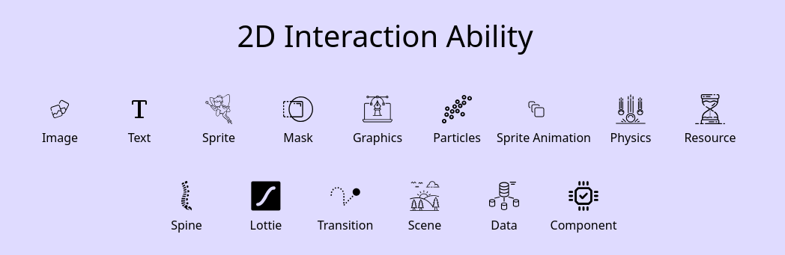
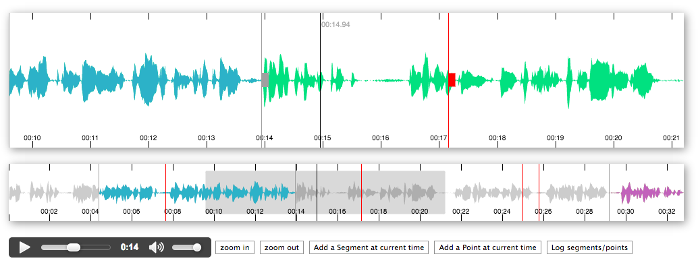
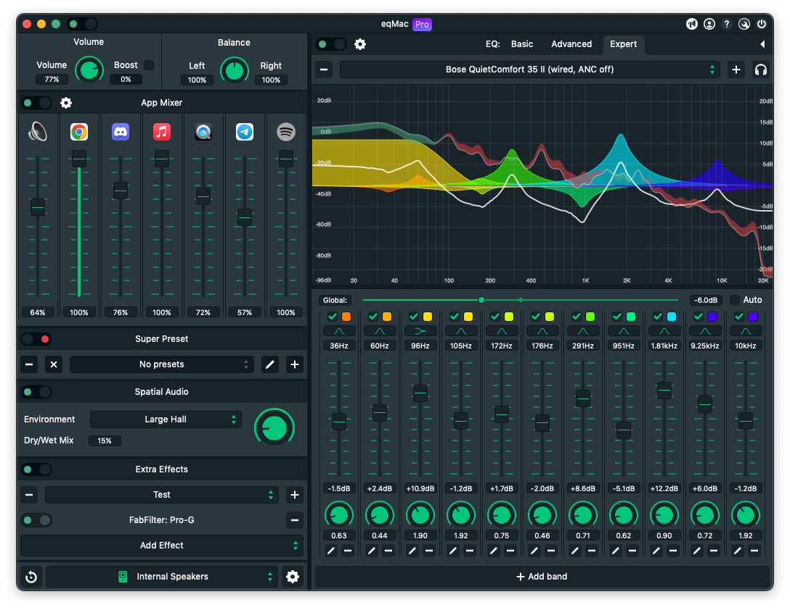
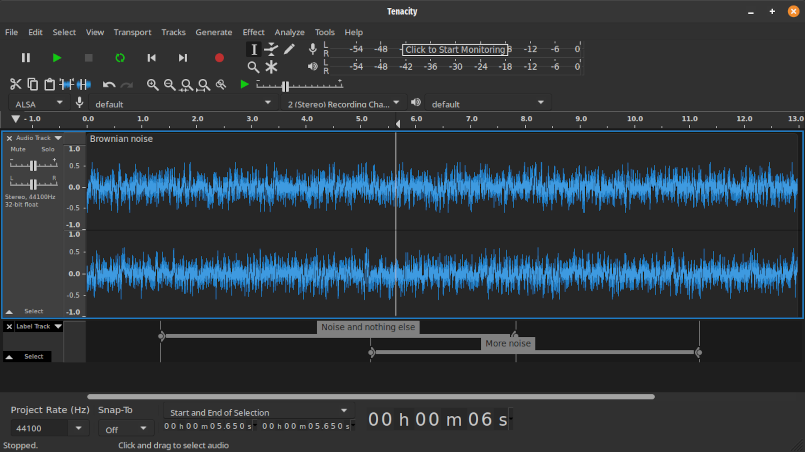

# naravisuals-web

> source code of my static site

[naravisuals-web](https://naravisuals-web.pages.dev/)

## current TODOS

- [ ] preload assets, lazy load
- [ ] polishes style
- [ ] article codeblock with clipboard copy
- [ ] fix article toc navigation
- [ ] sorting/grouping articles/2d/3d assets
- [ ] search bar for content
- [ ] global light/dark theme toggle
- [ ] global theme switch

## previous TODOS

- NONE

## dispose TODOS

- NONE

## INSPIRATION

- https://github.com/eva-engine/eva.js
- https://github.com/jagenjo/litegraph.js
- https://github.com/bbc/peaks.js
- https://github.com/bitgapp/eqMac
- https://surge-synthesizer.github.io/
- https://codeberg.org/tenacityteam/tenacity

---

