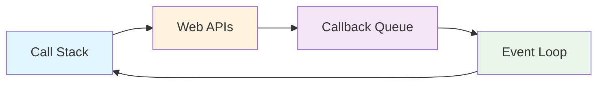
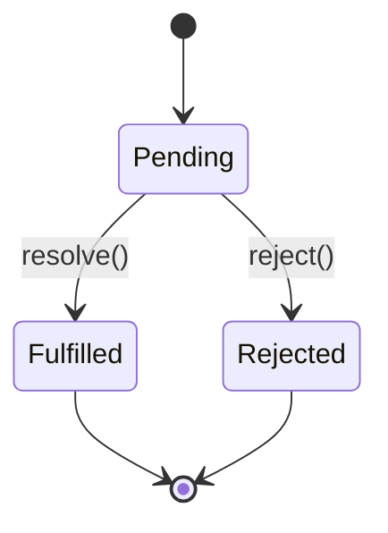

# Async JavaScript Patterns

JavaScript's asynchronous nature is fundamental to modern web development.

## The Event Loop



## Promise States



## Basic Patterns

### Promise Chain

```javascript
fetchData()
  .then(process)
  .then(save)
  .catch(handleError);
```

### Async/Await

```javascript
async function getUserData(userId) {
  try {
    const user = await fetchUser(userId);
    const posts = await fetchPosts(userId);
    return { user, posts };
  } catch (error) {
    console.error('Failed:', error);
    throw error;
  }
}
```

### Parallel Execution

```javascript
const [users, posts, comments] = await Promise.all([
  fetchUsers(),
  fetchPosts(),
  fetchComments()
]);
```

### Race Condition

```javascript
const result = await Promise.race([
  fetchData(timeout=5000),
  timeoutReject(5500)
]);
```

## Math: Throughput Calculation

For $n$ concurrent requests with average latency $t$:

$$\text{Throughput} = \frac{n}{t \times n + \text{overhead}}$$
