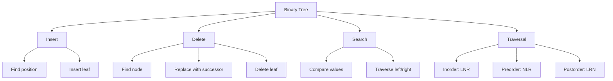
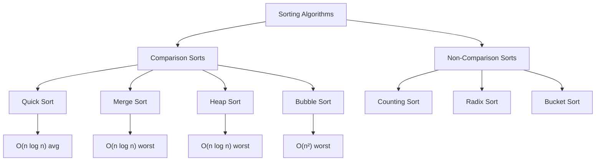

# Data Structures and Algorithms

Understanding algorithmic complexity is crucial for efficient programming.

## Big O Notation

Time complexity describes how the runtime grows with input size:

| Notation | Name | Example |
|----------|------|---------|
| $O(1)$ | Constant | Array access |
| $O(\log n)$ | Logarithmic | Binary search |
| $O(n)$ | Linear | Linear search |
| $O(n \log n)$ | Linearithmic | Merge sort |
| $O(n^2)$ | Quadratic | Bubble sort |
| $O(2^n)$ | Exponential | Fibonacci (naive) |

## Binary Tree Operations



## Sorting Algorithm Comparison



## Hash Table Implementation

```c
#define TABLE_SIZE 1000

typedef struct {
    char *key;
    int value;
    struct HashNode *next;
} HashNode;

typedef struct {
    HashNode *buckets[TABLE_SIZE];
} HashTable;

unsigned int hash(const char *key) {
    unsigned int hash = 5381;
    int c;
    while ((c = *key++))
        hash = ((hash << 5) + hash) + c;
    return hash % TABLE_SIZE;
}

void insert(HashTable *table, const char *key, int value) {
    unsigned int index = hash(key);
    HashNode *node = malloc(sizeof(HashNode));
    node->key = strdup(key);
    node->value = value;
    node->next = table->buckets[index];
    table->buckets[index] = node;
}
```

## Graph Algorithms

### Breadth-First Search (BFS)

```javascript
function bfs(graph, start) {
    const queue = [start];
    const visited = new Set([start]);
    const result = [];

    while (queue.length > 0) {
        const vertex = queue.shift();
        result.push(vertex);

        for (const neighbor of graph[vertex]) {
            if (!visited.has(neighbor)) {
                visited.add(neighbor);
                queue.push(neighbor);
            }
        }
    }

    return result;
}
```

### Dijkstra's Algorithm

```python
import heapq

def dijkstra(graph, start):
    queue = [(0, start)]
    distances = {node: float('infinity') for node in graph}
    distances[start] = 0

    while queue:
        current_distance, current_node = heapq.heappop(queue)

        if current_distance > distances[current_node]:
            continue

        for neighbor, weight in graph[current_node].items():
            distance = current_distance + weight
            if distance < distances[neighbor]:
                distances[neighbor] = distance
                heapq.heappush(queue, (distance, neighbor))

    return distances
```

## Complexity Analysis

For $n$ elements and $k$ buckets in bucket sort:

$$\text{Time Complexity} = O\left(\frac{n^2}{k} + k\right)$$

Optimal bucket count minimizes this function. For uniform distribution:

$$k \approx \sqrt{n}$$

This gives time complexity of $O(n)$ on average.
