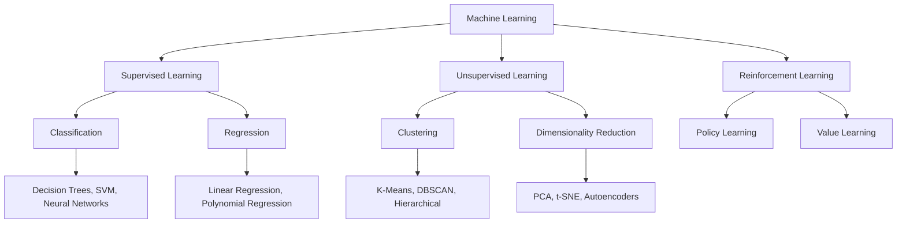
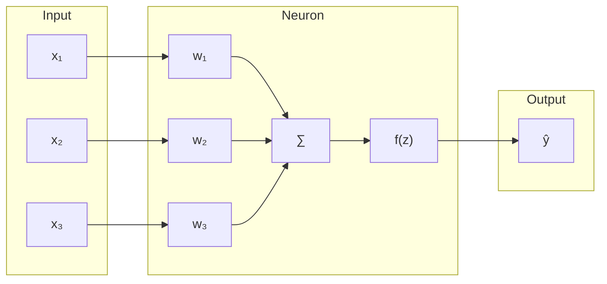
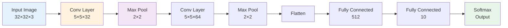
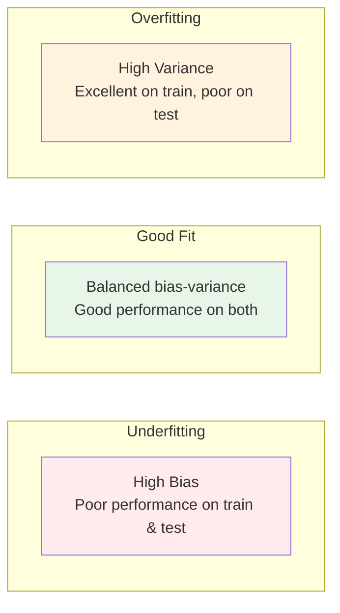

# Machine Learning Fundamentals

Machine learning is the study of algorithms that learn patterns from data.

## Learning Paradigms



## Linear Regression

### Mathematical Foundation

For a dataset with $n$ samples and $m$ features:

$$\mathbf{X} = \begin{bmatrix}
x_{11} & x_{12} & \cdots & x_{1m} \\
x_{21} & x_{22} & \cdots & x_{2m} \\
\vdots & \vdots & \ddots & \vdots \\
x_{n1} & x_{n2} & \cdots & x_{nm}
\end{bmatrix}, \quad
\mathbf{y} = \begin{bmatrix}
y_1 \\
y_2 \\
\vdots \\
y_n
\end{bmatrix}$$

The linear model:

$$\hat{y}_i = w_0 + w_1 x_{i1} + w_2 x_{i2} + \cdots + w_m x_{im} = \mathbf{w}^T \mathbf{x}_i$$

### Cost Function

Mean Squared Error (MSE):

$$J(\mathbf{w}) = \frac{1}{2n} \sum_{i=1}^n (\hat{y}_i - y_i)^2$$

### Gradient Descent

Update rule for parameter $w_j$:

$$w_j := w_j - \alpha \frac{\partial J}{\partial w_j}$$

Partial derivative:

$$\frac{\partial J}{\partial w_j} = \frac{1}{n} \sum_{i=1}^n (\hat{y}_i - y_i) x_{ij}$$

## Neural Networks

### Single Neuron Model



### Activation Functions

| Function | Formula | Derivative | Range |
|----------|---------|------------|-------|
| Sigmoid | $\sigma(z) = \frac{1}{1 + e^{-z}}$ | $\sigma'(z) = \sigma(z)(1 - \sigma(z))$ | (0, 1) |
| Tanh | $\tanh(z) = \frac{e^z - e^{-z}}{e^z + e^{-z}}$ | $1 - \tanh^2(z)$ | (-1, 1) |
| ReLU | $\max(0, z)$ | $1$ if $z > 0$, else $0$ | [0, ∞) |
| Leaky ReLU | $\max(0.01z, z)$ | $1$ if $z > 0$, else $0.01$ | (-∞, ∞) |

### Backpropagation

For a neural network with $L$ layers:

1. **Forward pass**: Compute activations layer by layer
2. **Backward pass**: Compute gradients from output to input

For layer $l$, error term:

$$\delta^{(l)} = \frac{\partial J}{\partial z^{(l)}}$$

Weight update:

$$\mathbf{W}^{(l)} := \mathbf{W}^{(l)} - \alpha \frac{\partial J}{\partial \mathbf{W}^{(l)}}$$

## Convolutional Neural Networks (CNNs)

### Convolution Operation

For input $\mathbf{X}$ and kernel $\mathbf{K}$:

$$(\mathbf{X} * \mathbf{K})_{i,j} = \sum_m \sum_n \mathbf{X}_{i+m,j+n} \mathbf{K}_{m,n}$$

### CNN Architecture



## Training Best Practices

### Data Splitting

```python
from sklearn.model_selection import train_test_split

# Split data: 60% train, 20% validation, 20% test
X_train, X_temp, y_train, y_temp = train_test_split(X, y, test_size=0.4, random_state=42)
X_val, X_test, y_val, y_test = train_test_split(X_temp, y_temp, test_size=0.5, random_state=42)
```

### Regularization Techniques

1. **L2 Regularization** (Weight Decay):
   $$J(\mathbf{w}) = J_0(\mathbf{w}) + \frac{\lambda}{2} \|\mathbf{w}\|^2$$

2. **Dropout**:
   - Randomly zero out neurons during training
   - Prevents co-adaptation of features

3. **Early Stopping**:
   - Monitor validation loss
   - Stop when validation loss stops decreasing

### Cross-Validation

```python
from sklearn.model_selection import cross_val_score

# K-fold cross-validation
scores = cross_val_score(model, X, y, cv=5)
print(f"Mean accuracy: {scores.mean():.3f} (+/- {scores.std() * 2:.3f})")
```

## Evaluation Metrics

### Classification Metrics

For binary classification:

| Metric | Formula |
|--------|---------|
| Accuracy | $\frac{TP + TN}{TP + TN + FP + FN}$ |
| Precision | $\frac{TP}{TP + FP}$ |
| Recall | $\frac{TP}{TP + FN}$ |
| F1-Score | $2 \times \frac{Precision \times Recall}{Precision + Recall}$ |

### Confusion Matrix

```
Predicted →   Positive    Negative
Actual ↓
Positive         TP          FN
Negative         FP          TN
```

## Overfitting vs Underfitting



## Gradient Boosting

### Algorithm Overview

1. Initialize model with constant prediction
2. For each iteration:
   - Compute pseudo-residuals
   - Fit weak learner to residuals
   - Update model by adding scaled weak learner

### XGBoost Objective

$$Obj = \sum_i l(y_i, \hat{y}_i) + \sum_k \Omega(f_k)$$

Where:
- $l$ is the loss function
- $\Omega(f) = \gamma T + \frac{1}{2} \lambda \|\mathbf{w}\|^2$ is the regularization term

This comprehensive foundation covers the core concepts needed for machine learning applications.
