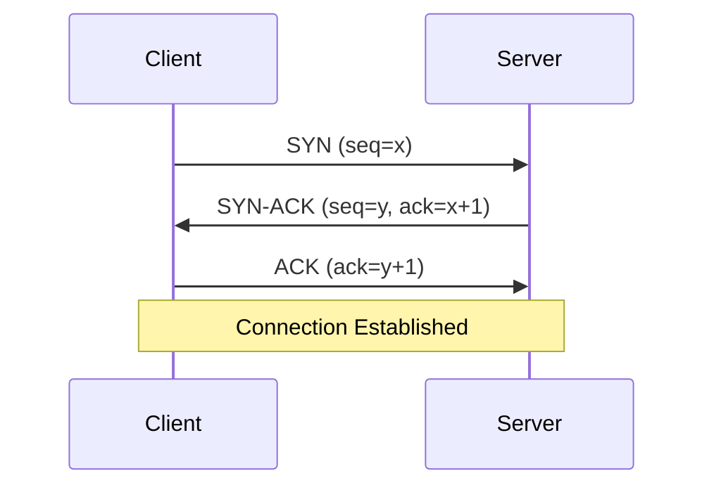
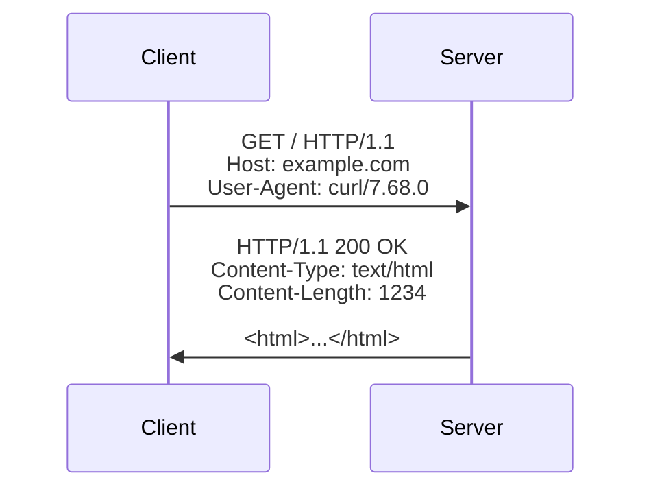
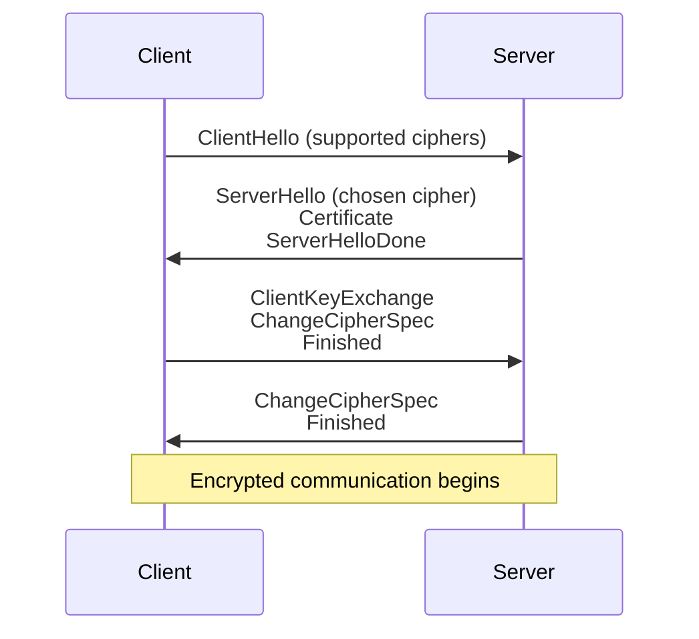

# Network Programming Fundamentals

Understanding network communication is essential for modern application development.

## OSI Model vs TCP/IP Model

```mermaid
graph TD
    subgraph OSI["OSI Model (7 Layers)"]
        A1[Application Layer]
        A2[Presentation Layer]
        A3[Session Layer]
        A4[Transport Layer]
        A5[Network Layer]
        A6[Data Link Layer]
        A7[Physical Layer]
    end

    subgraph TCPIP["TCP/IP Model (4 Layers)"]
        B1[Application Layer]
        B2[Transport Layer]
        B3[Internet Layer]
        B4[Network Access Layer]
    end

    A1 --> A2 --> A3 --> A4 --> A5 --> A6 --> A7
    B1 --> B2 --> B3 --> B4

    style A1 fill:#e1f5fe
    style B1 fill:#fff3e0
```



## TCP Three-Way Handshake



## Socket Programming in C

### TCP Server

```c
#include <stdio.h>
#include <stdlib.h>
#include <string.h>
#include <unistd.h>
#include <sys/types.h>
#include <sys/socket.h>
#include <netinet/in.h>

int main() {
    int sockfd, newsockfd, portno = 8080;
    socklen_t clilen;
    char buffer[256];
    struct sockaddr_in serv_addr, cli_addr;
    int n;

    // Create socket
    sockfd = socket(AF_INET, SOCK_STREAM, 0);
    if (sockfd < 0) {
        perror("ERROR opening socket");
        exit(1);
    }

    // Initialize server address structure
    bzero((char *) &serv_addr, sizeof(serv_addr));
    serv_addr.sin_family = AF_INET;
    serv_addr.sin_addr.s_addr = INADDR_ANY;
    serv_addr.sin_port = htons(portno);

    // Bind socket to address
    if (bind(sockfd, (struct sockaddr *) &serv_addr, sizeof(serv_addr)) < 0) {
        perror("ERROR on binding");
        exit(1);
    }

    // Listen for connections
    listen(sockfd, 5);
    clilen = sizeof(cli_addr);

    // Accept connection
    newsockfd = accept(sockfd, (struct sockaddr *) &cli_addr, &clilen);
    if (newsockfd < 0) {
        perror("ERROR on accept");
        exit(1);
    }

    // Read and write data
    bzero(buffer, 256);
    n = read(newsockfd, buffer, 255);
    if (n < 0) {
        perror("ERROR reading from socket");
        exit(1);
    }

    printf("Received: %s\n", buffer);
    n = write(newsockfd, "Message received", 16);
    if (n < 0) {
        perror("ERROR writing to socket");
        exit(1);
    }

    close(newsockfd);
    close(sockfd);
    return 0;
}
```

### TCP Client

```c
#include <stdio.h>
#include <stdlib.h>
#include <unistd.h>
#include <string.h>
#include <sys/types.h>
#include <sys/socket.h>
#include <netinet/in.h>
#include <netdb.h>

void error(const char *msg) {
    perror(msg);
    exit(0);
}

int main(int argc, char *argv[]) {
    int sockfd, portno, n;
    struct sockaddr_in serv_addr;
    struct hostent *server;
    char buffer[256];

    if (argc < 3) {
        fprintf(stderr,"usage %s hostname port\n", argv[0]);
        exit(0);
    }

    portno = atoi(argv[2]);
    sockfd = socket(AF_INET, SOCK_STREAM, 0);

    if (sockfd < 0) error("ERROR opening socket");

    server = gethostbyname(argv[1]);
    if (server == NULL) {
        fprintf(stderr,"ERROR, no such host\n");
        exit(0);
    }

    bzero((char *) &serv_addr, sizeof(serv_addr));
    serv_addr.sin_family = AF_INET;
    bcopy((char *)server->h_addr, (char *)&serv_addr.sin_addr.s_addr, server->h_length);
    serv_addr.sin_port = htons(portno);

    if (connect(sockfd, (struct sockaddr *) &serv_addr, sizeof(serv_addr)) < 0)
        error("ERROR connecting");

    printf("Please enter the message: ");
    bzero(buffer, 256);
    fgets(buffer, 255, stdin);

    n = write(sockfd, buffer, strlen(buffer));
    if (n < 0) error("ERROR writing to socket");

    bzero(buffer, 256);
    n = read(sockfd, buffer, 255);
    if (n < 0) error("ERROR reading from socket");

    printf("%s\n", buffer);
    close(sockfd);

    return 0;
}
```

## HTTP Protocol

### Request/Response Cycle



## WebSocket Protocol

```javascript
// Server (Node.js with ws)
const WebSocket = require('ws');
const wss = new WebSocket.Server({ port: 8080 });

wss.on('connection', (ws) => {
    console.log('Client connected');

    ws.on('message', (message) => {
        console.log('Received:', message);
        ws.send('Echo: ' + message);
    });

    ws.on('close', () => {
        console.log('Client disconnected');
    });
});
```

```javascript
// Client (Browser)
const ws = new WebSocket('ws://localhost:8080');

ws.onopen = () => {
    console.log('Connected to WebSocket');
    ws.send('Hello Server!');
};

ws.onmessage = (event) => {
    console.log('Received:', event.data);
};

ws.onclose = () => {
    console.log('Connection closed');
};
```

## Network Security

### SSL/TLS Handshake



## Performance Considerations

Network latency and bandwidth affect application performance:

$$\text{Round-trip time (RTT)} = 2 \times \text{Propagation Delay}$$

$$\text{Throughput} = \frac{\text{Window Size}}{\text{RTT}}$$

For TCP congestion control:

$$\text{Congestion Window} = \min(\text{Receiver Window}, \text{Congestion Window})$$

These formulas help optimize network applications for better performance.
