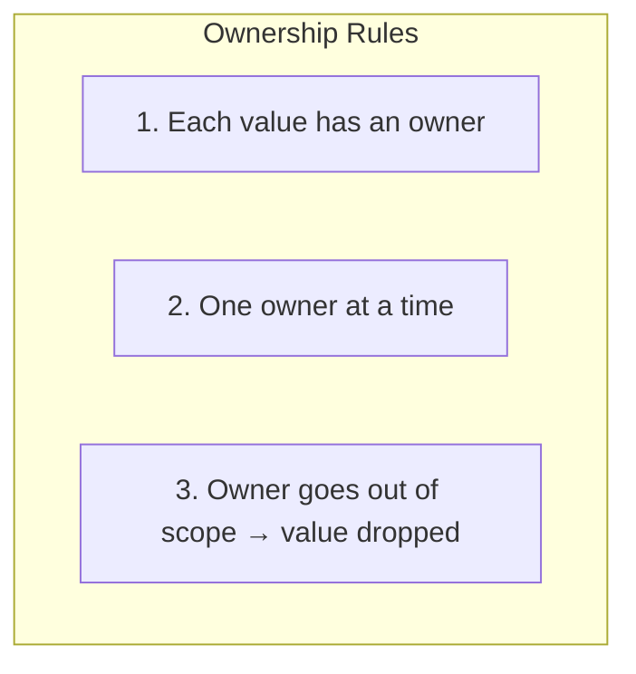
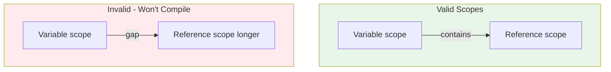

# Rust Ownership System

Rust's ownership model ensures memory safety without garbage collection.

## The Three Rules



## Borrowing

```mermaid
flowchart LR
    String["String<br/>owner: s1"] -->|"borrow (&)|" Ref["&String<br/>reference"]
    String -->|"mutate (&mut)|" MutRef["&mut String<br/>mutable reference"]

    style String fill:#e3f2fd
    style Ref fill:#fff3e0
    style MutRef fill:#fce4ec
```

## Ownership in Action

```rust
fn main() {
    // s1 owns the String
    let s1 = String::from("hello");

    // s2 takes ownership
    let s2 = s1;

    // println!("{}", s1); // ERROR: s1 is no longer valid
    println!("{}", s2);   // OK: s2 owns the data

    // Borrowing with references
    let len = calculate_length(&s2);
    println!("Length of '{}' is {}", s2, len);
}

fn calculate_length(s: &String) -> usize {
    s.len()
} // s goes out of scope but doesn't drop the value
```

## The Borrow Checker



## Lifetimes

```rust
fn longest<'a>(s1: &'a str, s2: &'a str) -> &'a str {
    if s1.len() > s2.len() {
        s1
    } else {
        s2
    }
}
```

The `'a` lifetime annotation means: "The returned reference will live as long as the shorter of the two input references."

## Math: Move Semantics Performance

For $n$ elements, moving is $O(1)$ while cloning is $O(n)$:

$$\text{Copy time} = n \times \text{element\_size}$$

$$\text{Move time} = 1 \times \text{pointer\_size}$$
