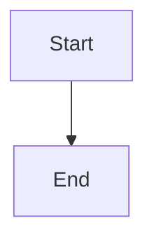
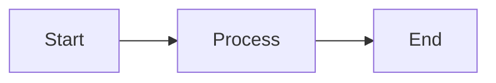

# Codeblock Categorization System

## Overview

The build system now properly categorizes and exposes different types of codeblocks, providing detailed statistics on:
- **Mermaid diagrams** - Visual diagrams for workflows and architectures
- **Text/TXT blocks** - ASCII art, UI layouts, examples, and documentation snippets
- **Programming Languages** - TypeScript, JavaScript, Python, etc.
- **Shell/Terminal** - Bash commands, terminal sessions
- **Data Formats** - JSON, YAML, XML, CSV, SQL
- **Markup** - HTML, Markdown, LaTeX
- **Web Technologies** - CSS, SCSS, JSX, TSX
- **Configuration** - INI, CFG, ENV, TOML
- **Shader/3D** - GLSL, HLSL (for Blender materials)

## 📊 Current Project Statistics

```
Total codeblocks: 1,145
With descriptions: 1,145 (100%) ✓

Categories:
  Text/TXT               1,046 (91.4%)
  Mermaid                  81 (7.1%)
  Shell/Terminal           18 (1.5%)

Top Languages:
  txt                  1,001
  mermaid               81
  text                  45
  bash                  18
```

## 🎨 Category Color Coding

The validation system uses color coding for easy visual identification:

| Category | Color | Description |
|----------|-------|-------------|
| **Mermaid** | 🟣 Magenta | Diagram visualizations |
| **Text/TXT** | 🔵 Blue | ASCII art, UI examples, documentation |
| **Programming Language** | 🟢 Green | TypeScript, JavaScript, Python, etc. |
| **Web Technology** | 🔷 Cyan | CSS, SCSS, JSX, TSX, Vue, Svelte |
| **Data Format** | 🟡 Yellow | JSON, YAML, XML, CSV, SQL |
| **Shell/Terminal** | 🔴 Red | Bash, sh, shell commands |
| **Markup** | ⚫ Dim | HTML, Markdown, LaTeX |
| **Configuration** | ⚫ Gray | INI, CFG, ENV, TOML |
| **Shader/3D** | ⚪ Bright | GLSL, HLSL shaders |
| **Unspecified** | ⚫ Gray | Unknown or empty language |

## 📋 How Categorization Works

### Language Detection

The validator parses code fence info strings:

````markdown


The language `mermaid` is extracted and categorized as **"Mermaid"**.

````markdown
```txt:desc=Example UI layout
┌─────────────────┐
│  Panel          │
└─────────────────┘
```

The language `txt` is categorized as **"Text/TXT"**.

````markdown
```bash:desc=Install dependencies
bun install
```

The language `bash` is categorized as **"Shell/Terminal"**.

### Categorization Logic

```typescript
function categorizeLanguage(lang: string): string {
  const lower = lang.toLowerCase();

  // Mermaid diagrams
  if (lower === "mermaid") return "Mermaid";

  // Text/plain blocks
  if (["txt", "text", "plain", "plaintext"].includes(lower)) return "Text/TXT";

  // Shell/terminal
  if (["bash", "sh", "shell", "zsh", "fish", "powershell", "cmd"].includes(lower))
    return "Shell/Terminal";

  // ... more categories
}
```

## 🔍 Validation Output Examples

### Codeblock Validator Output

```
🔍 Validating codeblock descriptions...

══════════════════════════════════════════════════════════════════════

Summary:
   Total codeblocks scanned: 1145
   Missing descriptions: 0
   Have descriptions: 1145

📊 Codeblock Categories:

   Text/TXT               1046 total | 1046 with desc | ✓
   Mermaid                  81 total |   81 with desc | ✓
   Shell/Terminal           18 total |   18 with desc | ✓

🔤 Top Languages:

   txt                  1001
   mermaid              81
   text                 45
   bash                 18

✓ All codeblocks have descriptions!
```

### Comprehensive Validator Output (Per-Article)

```
✓ docs/02-interface-basics/01-interface-basics.md
   Lines: 568 | Words: 1920
   Codeblocks: 15 total, 15 with desc, 0 without
     Categories: Text/TXT: 7, Mermaid: 7, Shell/Terminal: 1
   Admonitions: 5 (warning: 2, tip: 2, note: 1)
   Mermaid diagrams: 7
   References: No | Links: 0 | Citations: 0 | Footnotes: 0
```

### Comprehensive Validator Output (Overall)

```
Codeblocks:
   Total codeblocks:          1145
   With descriptions:         1145
   Without descriptions:      0

   Categories:
     Text/TXT               1046 total | ✓
     Mermaid                  81 total | ✓
     Shell/Terminal           18 total | ✓
```

## 📝 Codeblock Types Explained

### 1. Mermaid Diagrams (81 blocks - 7.1%)

**Purpose:** Visual diagrams showing workflows, architectures, decision trees, and system designs.

**Example:**
````markdown

````

**Usage in Project:**
- Workflow diagrams
- System architectures
- Decision trees
- Process flows
- Component relationships

### 2. Text/TXT Blocks (1,046 blocks - 91.4%)

**Purpose:** ASCII art, UI layouts, example outputs, documentation snippets, and structured text examples.

**Example:**
````markdown
```txt:desc=Example UI panel layout
┌─────────────────────────────────┐
│  Outliner                        │
├─────────────────────────────────┤
│  👁️  📷  🖼️  Collection         │
│   ●    ●    ●   ├─ Camera       │
│   ●    ●    ●   ├─ Light        │
└─────────────────────────────────┘
```
````

**Usage in Project:**
- Blender UI panel representations
- Keyboard shortcut examples
- File structure examples
- Conceptual examples
- Before/after comparisons

### 3. Shell/Terminal (18 blocks - 1.5%)

**Purpose:** Command-line instructions, terminal sessions, and bash scripts.

**Example:**
````markdown
```bash:desc=Install Blender dependencies
sudo apt update
sudo apt install blender
```
````

**Usage in Project:**
- Installation commands
- Build scripts
- CLI usage examples

## 🎯 Benefits of Categorization

### 1. **Quality Assurance**
- Ensure each category has appropriate descriptions
- Track distribution of codeblock types across articles
- Identify articles missing visual diagrams

### 2. **Content Planning**
- See which articles have too many/few diagrams
- Balance text examples with visual content
- Identify opportunities for more Mermaid diagrams

### 3. **Documentation Quality**
- 100% description coverage across all categories ✓
- Proper mix of visual (Mermaid) and textual (TXT) content
- Clear categorization helps readers understand content type

### 4. **Build System Insights**
- Know exactly what types of content are in the docs
- Track changes in codeblock distribution over time
- Identify unusual or uncategorized languages

## 🔧 Usage

### Run Codeblock Validator

```bash
# Validate descriptions and show categories
bun run validate:codeblocks

# Comprehensive validation with categories
bun run validate:articles
```

### Output Includes

1. **Total statistics** - All codeblocks scanned
2. **Category breakdown** - Per-type counts and validation status
3. **Language breakdown** - Top 15 languages by frequency
4. **Per-article details** - Categories used in each article

## 📈 Future Enhancements

Potential improvements:

- [ ] Track category trends over time
- [ ] Suggest Mermaid diagrams for text-heavy articles
- [ ] Validate Mermaid syntax
- [ ] Auto-categorize uncategorized blocks
- [ ] Generate category reports for CI/CD
- [ ] Set minimum Mermaid diagram requirements per article

---

**Last Updated:** April 14, 2026  
**Total Categories:** 10  
**Total Codeblocks:** 1,145  
**Description Coverage:** 100% ✓
