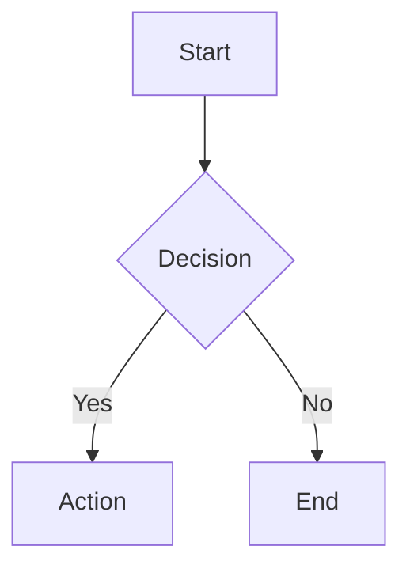
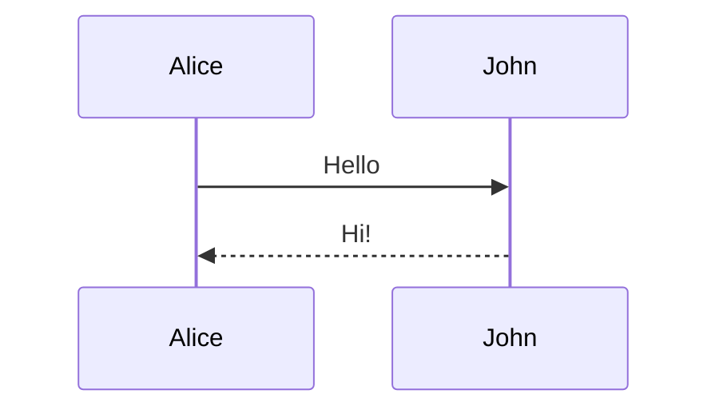

# Mermaid Validation Quick Reference

## Commands

```bash
bun run validate                    # Run all validators
bun run validate:strict             # Strict mode (exit on error)
bun run validate:stats              # Statistics only
bun run scripts/test-mermaid-validation.ts  # Test validation logic
```

## Valid Diagram Types

| Category | Types |
|----------|-------|
| **Flowcharts** | `graph`, `flowchart` |
| **Sequences** | `sequenceDiagram` |
| **Classes** | `classDiagram`, `classDiagram-v2` |
| **States** | `stateDiagram`, `stateDiagram-v2` |
| **Data** | `erDiagram`, `gantt`, `pie` |
| **Charts** | `quadrantChart`, `xyChart` |
| **Thinking** | `mindmap`, `timeline`, `journey` |
| **Requirements** | `requirementDiagram` |
| **Version Control** | `gitGraph` |
| **Data Flow** | `sankey` |
| **Layouts** | `block`, `block-beta` |
| **Network** | `packet`, `packet-beta` |
| **Architecture** | `c4Context`, `c4Container`, `c4Component`, `c4Dynamic`, `c4Deployment` |
| **Directives** | `%%{init: {...}}%%` |

## ❌ Rejected | ✅ Allowed

| Pattern | ❌ Rejected | ✅ Allowed |
|---------|------------|-----------|
| **Empty content** | `""`, `"  "` | `"Label"` |
| **Quotes** | `""`, `''`, `"  "`, `"&&*"` | `"Text"`, `"中文"` |
| **HTML entities** | `&#x26;`, `&#38;` | `&amp;`, `&lt;`, `&gt;` |
| **Encoded** | `&amp;&amp;`, `\x26`, `%26` | Plain text |
| **Brackets** | `[`, `{`, `(`, `]` | `[]`, `{}`, `()` |
| **Diagram type** | `package`, `state-viz` | `graph`, `stateDiagram` |

## Common Errors

### 1. Invalid diagram type
```
Error: Invalid diagram type
Fix: Use graph TD, flowchart LR, sequenceDiagram, etc.
```

### 2. Empty quotes
```
Error: Empty quotes detected
Fix: Add meaningful text: A["Label"] not A[""]
```

### 3. Special chars only
```
Error: Quotes contain only special characters
Fix: Include alphanumeric chars: A["Node1"] not A["&&*"]
```

### 4. Unbalanced brackets
```
Error: Unbalanced brackets
Fix: Balance them: A[Node] not A[Node
```

### 5. HTML entities
```
Error: HTML entity in diagram
Fix: Use plain text, not &#x26; or encoded chars
```

## Examples

### ✅ Good


### ❌ Bad
```mermaid
invalidType
  A[""]-->B&#x26;C
```

### ✅ Good


### ❌ Bad
```mermaid
state-viz
  { "A" --> "B" }
```
