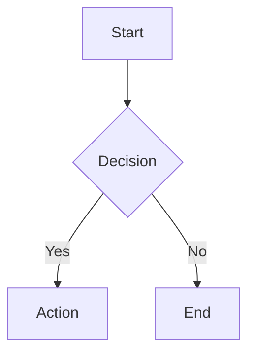

# Mermaid Validation Implementation Summary

## What Was Implemented

A comprehensive, strict validation system for Mermaid.js diagram content that catches invalid characters, malformed syntax, and ensures proper formatting at build-time.

## New Files Created

### 1. Core Validation Logic
**File:** `scripts/plugins/validators/mermaid-content.ts`
- Main validation function: `validateMermaidContent()`
- Validates:
  - Empty content
  - Invalid HTML entities (`&#x26;`, etc.)
  - Double-encoded ampersands (`&amp;&amp;`)
  - Hex/Unicode escape sequences (`\x26`, `\u0026`)
  - URL-encoded characters (`%26`)
  - Empty or whitespace-only quotes
  - Quotes with only special characters
  - Unbalanced brackets (`{`, `[`, `(`)
  - Invalid diagram types
- Returns array of validation errors with messages and details

### 2. Validator Plugin
**File:** `scripts/plugins/validators/mermaid-validator.ts`
- Markdown validator plugin that integrates with the validation pipeline
- Scans all markdown files for mermaid code blocks
- Validates each diagram's content
- Reports errors with file paths and line numbers
- Marked as `isStrict: true` (fails the build)

### 3. Test Suite
**Files:**
- `scripts/test-mermaid-validation.ts` - Quick test script (14 test cases)
- `tests/mermaid-validation.test.ts` - Unit tests for bun:test

### 4. Documentation
**File:** `docs/02-guides/99-mermaid-validation.md`
- Comprehensive guide on the validation system
- Examples of common errors and how to fix them
- Best practices for writing valid mermaid diagrams

## Modified Files

### 1. Mermaid Plugin
**File:** `scripts/plugins/mermaid.ts`
- Added import: `validateMermaidContent` from `mermaid-content.ts`
- Added validation step after decoding HTML entities
- On validation failure:
  - Logs error to console
  - Creates error container with validation error message
  - Shows detailed error in the UI (instead of crashing)

### 2. Validator Registry
**File:** `scripts/plugins/validators/index.ts`
- Added `mermaidValidator` to the validators array
- Registered in the plugin system
- Runs automatically with `bun run validate`

## Validation Rules

### ❌ Rejected Patterns

1. **Empty Content**
   - Empty diagrams
   - Whitespace-only content

2. **Invalid Characters**
   - HTML entities: `&#x26;`, `&#38;`, etc.
   - Double-encoded: `&amp;&amp;`
   - Hex escapes: `\x26`
   - Unicode escapes: `\u0026`
   - URL-encoded: `%26`

3. **Invalid Quotes**
   - Empty: `""`, `''`
   - Whitespace-only: `"  "`
   - Special chars only: `"&&*^%"`

4. **Unbalanced Brackets**
   - Mismatched `{}` pairs
   - Mismatched `[]` pairs
   - Mismatched `()` pairs

5. **Invalid Diagram Types**
   - Must start with valid type (graph, flowchart, sequenceDiagram, etc.)
   - Or directive syntax: `%%{init: ...}%%`

### ✅ Allowed Content

- Valid diagram types with proper syntax
- Balanced brackets of all types
- Quotes with alphanumeric content (including Unicode)
- Common HTML entities: `&amp;`, `&lt;`, `&gt;`, `&quot;`, `&apos;`, `&nbsp;`
- Directive syntax for configuration

## How to Use

### Run Validation

```bash
# All validators
bun run validate

# Strict mode (exit on error)
bun run validate:strict

# Statistics only
bun run validate:stats
```

### Test Validation Logic

```bash
# Quick test script
bun run scripts/test-mermaid-validation.ts

# Expected output: 14 passed, 0 failed
```

### Example Valid Diagram



### Example Invalid Diagram (Will Fail)

```mermaid
invalidType;
  A[""]-->B&#x26;C;
```

Error output:
```
❌ Mermaid validation error(s) in diagram MERMAIDBLOCK0END:
  - Invalid diagram type: Must start with valid diagram type
  - Empty quotes detected: Found: ""
  - HTML entity in diagram: Found: &#x26;
```

## Real Issues Found

Running validation on the existing docs found **4 errors**:

1. **docs/02-guides/08-deployment.md:39**
   - Invalid diagram type: "package" (not a valid mermaid type)

2. **docs/02-guides/10-cli-reference.md:36**
   - Empty quotes detected
   - Invalid diagram type: "state-viz" (not a valid mermaid type)

3. **docs/02-guides/11-application-bootstrap.md:204**
   - Empty quotes detected

## Integration Points

### Build Pipeline
```
Markdown → Mermaid Plugin (validates) → HTML Output
                           ↓
                    Validation Error? → Show Error UI
```

### Validation Pipeline
```
All Validators → mermaidValidator → Report Issues
                                      ↓
                               Fail Build (strict)
```

## Benefits

1. **Early Detection** - Catches issues at build-time, not runtime
2. **Strict Validation** - Prevents invalid content from being deployed
3. **Clear Error Messages** - Shows exactly what's wrong and where
4. **Automatic** - Runs as part of the build process
5. **Comprehensive** - Checks multiple aspects of diagram quality

## Next Steps

To fix the current validation errors in the docs:

1. Replace `package` with valid diagram type (e.g., `graph`)
2. Replace `state-viz` with `stateDiagram`
3. Fill in empty quotes with meaningful labels

## Future Enhancements

Potential improvements:
- [ ] Deeper syntax validation using Mermaid's parser
- [ ] Diagram-specific validations
- [ ] Auto-fix suggestions
- [ ] Anti-pattern detection (circular dependencies, etc.)
- [ ] Connection validation for graphs
