# Project Overview

rspack-react-docs is a **Static Site Generator (SSG)** designed specifically for building documentation websites. It takes Markdown files, processes them through a customizable plugin pipeline, and produces a fully interactive Single Page Application (SPA).

:::note Zero Runtime APIs
Everything is generated at build time. The frontend is a pure React SPA with no backend, no API calls, and no server-side rendering. All documentation content is baked into TypeScript files during the build.
:::

## What Problem Does This Solve?

Building a documentation website from scratch involves:

1. **Parsing Markdown** — converting `.md` files to HTML
2. **Syntax highlighting** — coloring code blocks with Shiki or Prism
3. **Building navigation** — sidebars, breadcrumbs, table of contents
4. **Adding interactivity** — search, theme switching, copy buttons, diagram rendering
5. **SEO optimization** — meta tags, structured data, sitemaps

This project provides all of that out of the box, with a clean architecture that's easy to customize.

## Key Architecture Decisions

```mermaid:desc=Mindmap showing the five core design decisions behind the project.
mindmap
  root((Design Decisions))
    Build-Time Generation
      Markdown scanned at build
      Content in TS files
      Zero runtime fetch
      Instant page loads
    rspack Over Webpack
      10x faster builds
      SWC compilation
      Compatible plugins
      Native HMR
    Custom Markdown Pipeline
      marked base parser
      Plugin system
      Math, admonitions, mermaid
      Extensible
    Dependency Injection
      Swappable services
      Easy testing
      Browser API wrappers
      Mock-friendly
    Progressive Enhancement
      Works without JS for basic content
      Mermaid/Math loaded async
      Graceful degradation
      Print-friendly
```

## How It Works

```mermaid:desc=Data flow from authoring markdown to viewing in browser.
flowchart LR
    A["Author\nwrites .md"] --> B["build-docs.mts\nscans + parses"]
    B --> C["Plugins transform\nmath, admonitions, mermaid"]
    C --> D["Shiki highlights\ncode blocks"]
    D --> E["Generate\nsrc/generated/*.ts"]
    E --> F["rspack bundles\nReact SPA"]
    F --> G["dist/\nserved as static files"]
    G --> H["Browser renders\ninteractive docs site"]

    style A fill:#e8f5e9
    style B fill:#fff3e0
    style C fill:#fff3e0
    style D fill:#fff3e0
    style E fill:#e3f2fd
    style F fill:#e3f2fd
    style G fill:#f3e5f5
    style H fill:#f3e5f5
```



### 1. Build-Time Content Scanning

The build script (`scripts/build-docs.mts`) walks the `docs/` directory, reads every `.md` file, extracts frontmatter, parses Markdown with `marked`, runs it through plugins, highlights code with Shiki, and generates TypeScript files under `src/generated/`.

### 2. React SPA

The frontend (`src/frontend.tsx`) is a React application that reads the generated data and renders it. It handles routing, sidebar navigation, table of contents, theme switching, and renders Mermaid diagrams and MathJax math on the client.

### 3. No Backend

There is no server, no API routes, and no database. Everything is static. The "database" is TypeScript files generated from Markdown.

## Project Structure

```
rspack-react-docs/
├── docs/                       # Markdown documentation source
│   ├── 00-welcome.md           # Welcome page
│   ├── 01-getting-started/     # Getting started guides
│   ├── 02-architecture/        # Architecture documentation
│   ├── 03-guides/              # User guides
│   ├── 04-reference/           # Technical reference
│   └── 05-contributing/        # Contributing guides
├── src/                        # React frontend source
│   ├── generated/              # Auto-generated from docs (DO NOT EDIT)
│   ├── hooks/                  # 16 custom React hooks
│   ├── services/               # DI container + service providers
│   ├── styles/                 # Modular CSS files (22 files)
│   ├── App.tsx                 # Root application component
│   ├── DocViewer.tsx           # Markdown content renderer
│   ├── Sidebar.tsx             # Navigation sidebar
│   ├── TableOfContents.tsx     # Right-side TOC
│   ├── Breadcrumbs.tsx         # Breadcrumb navigation
│   ├── MetadataPanel.tsx       # Document metadata display
│   ├── DocStatsFooter.tsx     # Build statistics footer
│   ├── ArticleRefsPanel.tsx   # Article references panel
│   ├── ASTViewer.tsx          # Markdown AST debug viewer
│   ├── ast-parser.ts          # Markdown AST utilities
│   ├── frontend.tsx           # Entry point
│   └── index.html             # HTML template (MathJax loaded here)
├── scripts/
│   ├── cli.mts                 # Unified CLI (docts dev/build/etc.)
│   ├── build-docs.mts          # Content scanner + build pipeline
│   ├── validate-all.mts        # Unified markdown validator
│   ├── copy-libs.mts           # Copy MathJax/Mermaid to dist
│   └── plugins/                # Markdown plugin system
│       ├── index.ts            # Plugin registry
│       ├── types.ts            # Plugin interfaces
│       ├── math.ts             # LaTeX math plugin
│       ├── admonitions.ts      # Docusaurus-style admonitions
│       ├── mermaid.ts          # Mermaid diagram transformer
│       └── validators/         # Validation plugins
├── tests/                      # Jest + Testing Library tests
├── server/                     # Production server config
├── rspack.config.ts            # rspack bundler config
├── biome.json                  # Biome linter config
├── package.json                # Dependencies + scripts
└── tsconfig.json               # TypeScript config
```

## Technology Decisions

| Decision | Why |
|----------|-----|
| **rspack over webpack** | 10x faster builds, SWC-based, webpack-compatible |
| **marked over remark/rehype** | Simpler API, easier to customize renderer |
| **Shiki over Prism** | VS Code-quality highlighting, uses TextMate grammars |
| **goober over styled-components** | Tiny (1KB), no bundle size impact |
| **Valtio over Redux/Zustand** | Proxy-based, less boilerplate |
| **Custom DI over no DI** | Makes testing browser APIs possible |
| **Bun over npm** | Faster installs, native TypeScript execution |

---

Next: [Installation Guide](/docs/getting-started/installation)
