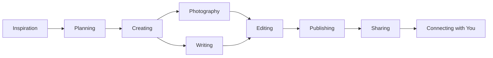

# Welcome to My Blog

Hello! I'm so glad you're here. This is the beginning of what I hope will be a meaningful journey together.

## Table of Contents

- [Why I Started This Blog](#why-i-started-this-blog)
- [What You'll Find Here](#what-youll-find-here)
- [My Story](#my-story)
- [Let's Connect](#lets-connect)

## Why I Started This Blog

For years, I've been collecting stories, experiences, and lessons in journals, photo albums, and scattered notes across my devices. But I realized that the true joy of sharing comes when we open our hearts to a wider community.

This blog is my digital home—a place where I can:

- **Share authentically** about my journey, struggles, and triumphs
- **Connect with like-minded souls** who appreciate genuine storytelling
- **Document the moments** that make life beautiful
- **Inspire others** to live intentionally and creatively

> "The best things in life aren't things." — Unknown

## What You'll Find Here

This blog is organized into several categories, each representing a different aspect of my life and interests:

### 📖 Personal Stories
Reflections on life, growth, and the lessons I'm learning along the way. These are the posts closest to my heart.

### 🌍 Travel Adventures
Stories from my journeys—both near and far. You'll find destination guides, travel tips, and the beautiful moments captured through my lens.

### 🎨 Creative Projects
A showcase of my creative endeavors, from photography to DIY projects. I believe everyone has a creative spark, and I love exploring mine.

### 🏡 Lifestyle & Wellness
Tips, routines, and thoughts on living a balanced, intentional life. Because how we live each day matters.

### 🌱 Growth & Learning
Books I've read, courses I've taken, and insights I've gained. Personal development is a lifelong journey.

## My Story

I'm a creative soul based on this beautiful planet, with a heart full of dreams and a mind full of stories. 

### What Drives Me

- **Curiosity** about the world and the people in it
- **Passion** for visual storytelling and authentic expression
- **Belief** that everyone has a unique story worth telling
- **Love** for connecting with others through shared experiences

### My Journey

Like many of us, my path hasn't been linear. I've explored different interests, tried various careers, and learned that the detours often lead to the most beautiful destinations.

What started as a hobby—taking photos, writing thoughts, creating things—has evolved into this space where I can share my perspective with the world.

### What I Value

| Value | What It Means to Me |
|-------|---------------------|
| **Authenticity** | Being real, vulnerable, and true to myself |
| **Creativity** | Finding beauty and making things that matter |
| **Connection** | Building genuine relationships with readers |
| **Growth** | Always learning, evolving, and becoming |
| **Gratitude** | Appreciating every moment and opportunity |

## Behind the Scenes

This blog is more than just words and images—it's a labor of love. Here's a glimpse of what goes into each post:

### My Creative Process

1. **Finding Inspiration** - Often happens during morning walks or quiet moments
2. **Capturing Moments** - Camera in hand, always ready for the perfect shot
3. **Writing from the Heart** - No filters, just honest words
4. **Polishing with Care** - Because quality matters
5. **Sharing with Hope** - That my words might touch someone's day

## Let's Connect

I'd love to hear from you! This blog isn't a monologue—it's a conversation.

### Ways to Reach Out

- **Email**: hello@example.com
- **Instagram**: Share your thoughts on my latest posts
- **Facebook**: Join our growing community
- **Twitter**: Quick conversations and updates

### What I'd Love to Hear

- Your own stories and experiences
- Topics you'd like me to write about
- Feedback on posts that resonated with you
- Collaboration ideas and creative projects

## A Note on Comments

Every comment, message, and share means the world to me. I try to respond to each one personally, because I believe in the power of genuine connection.

If you've read this far, thank you. You're already part of this journey, and I can't wait to see where it takes us together.

---

**With love and gratitude,**  
*Naranyala*

💌 *P.S. Don't forget to subscribe or follow on social media to stay updated on new posts!*
