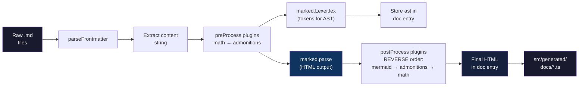
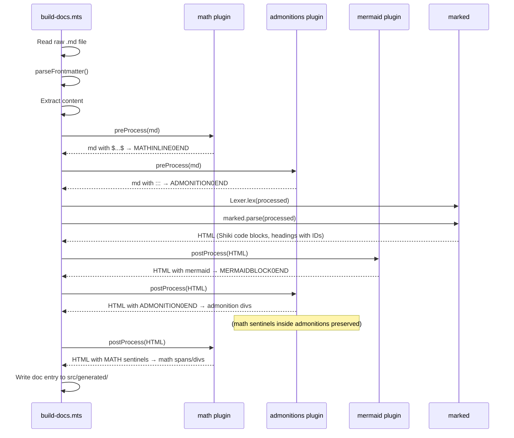

# Markdown Engine

This document explains how the rspack-react-docs SSG converts raw Markdown files into rendered HTML. The engine is built on **marked** (parser), **Shiki** (syntax highlighting), and a **plugin system** for math, admonitions, and Mermaid diagrams.

## Overview



The build pipeline in `/media/naranyala/Data/projects-remote/deepdive-tts-sst-playground/scripts/build-docs.mts` orchestrates everything:

```tsx
// Run preProcess plugins (in order)
for (const plugin of plugins) {
  if (plugin.preProcess) {
    processed = plugin.preProcess(processed);
  }
}

// Parse markdown to HTML
html = marked.parse(processed);

// Run postProcess plugins (in REVERSE order)
for (let i = plugins.length - 1; i >= 0; i--) {
  const plugin = plugins[i];
  if (plugin.postProcess) {
    html = plugin.postProcess(html);
  }
}
```

## Plugin Interface

`/media/naranyala/Data/projects-remote/deepdive-tts-sst-playground/scripts/plugins/types.ts` defines the `MarkdownPlugin` interface:

```tsx
export interface MarkdownPlugin {
  /** Unique plugin name */
  name: string;

  /**
   * Run BEFORE marked converts markdown to HTML.
   * Use to transform markdown syntax before parsing.
   */
  preProcess?(md: string): string;

  /**
   * Run AFTER marked converts markdown to HTML.
   * Use to transform HTML output, replace code blocks,
   * or inject scripts/styles.
   */
  postProcess?(html: string): string;
}
```

### Plugin Registry

`/media/naranyala/Data/projects-remote/deepdive-tts-sst-playground/scripts/plugins/index.ts` registers all plugins in execution order:

```tsx
import { admonitionsPlugin } from "./admonitions.ts";
import { mathPlugin } from "./math.ts";
import { mermaidPlugin } from "./mermaid.ts";

export const plugins: MarkdownPlugin[] = [mathPlugin, admonitionsPlugin, mermaidPlugin];
```

**Order matters**:

| Phase | Order | Reason |
|---|---|---|
| `preProcess` | math → admonitions | Extract `$...$` math FIRST (before admonitions might mangle it); then extract `:::` admonition blocks |
| `postProcess` | mermaid → admonitions → math (reverse) | Transform Mermaid code blocks into containers, then render admonition HTML, then restore math sentinels inside admonition content |

## Custom Renderer: marked

The build script creates a custom `marked.Renderer()` and overrides two methods: `code` and `heading`.

### Code Block Renderer with Shiki

```tsx
renderer.code = ({ text, lang: rawLang }) => {
  const meta = parseCodeInfo(rawLang);

  if (meta.lang && highlighter.getLoadedLanguages().includes(meta.lang as Language)) {
    const highlighted = highlighter.codeToHtml(text, { lang: meta.lang, theme: "github-dark" });
    return codeBlockWrapper(highlighted, meta);
  }
  // Fallback: escaped plain code
  const escaped = text.replace(/&/g, "&amp;").replace(/</g, "&lt;").replace(/>/g, "&gt;");
  return codeBlockWrapper(
    `<pre><code class="language-${meta.lang || ""}">${escaped}</code></pre>`,
    meta
  );
};
```

The `codeBlockWrapper` function produces a structured container:

```tsx
function codeBlockWrapper(inner: string, meta: CodeBlockMeta) {
  const langLabel = meta.label || (meta.lang
    ? meta.lang.charAt(0).toUpperCase() + meta.lang.slice(1) : "");
  const titleHtml = meta.title ? `<span class="code-title">${meta.title}</span>` : "";
  const descHtml = meta.desc ? `<div class="code-desc">${meta.desc}</div>` : "";
  const copyBtnHtml = meta.copy !== false
    ? `<button class="code-copy-btn" aria-label="Copy code" onclick="copyCode(this)">Copy</button>`
    : "";

  return [
    `<div class="code-block" data-lang="${meta.lang}" data-copy="${meta.copy !== false}" data-zoom="${meta.zoom !== false}">`,
    `<div class="code-header"><span class="code-lang">${langLabel}</span>${titleHtml}${copyBtnHtml}</div>`,
    inner,
    descHtml,
    `</div>`,
  ].join("");
}
```

### Code Block Metadata

The `parseCodeInfo` function parses the fence info string to extract optional parameters:

```tsx
/**
 * Supported syntaxes:
 *   ```typescript
 *   ```typescript:title=src/store.ts
 *   ```typescript:desc=A description
 *   ```typescript:label=Custom Label:copy=false:zoom=true
 *   ```mermaid:desc=User flow:zoom=true
 */
function parseCodeInfo(info: string | undefined): CodeBlockMeta {
  // Extract language before first colon
  // Then parse key=value pairs: title, desc, label, copy, zoom
}
```

The supported metadata keys:

| Key | Type | Default | Purpose |
|---|---|---|---|
| `title` | string | -- | File name or title shown in header |
| `desc` / `description` | string | -- | Description rendered below the code block |
| `label` | string | language name | Custom label instead of language name |
| `copy` | boolean | `true` | Whether to show the copy button |
| `zoom` | boolean | `true` | Whether to show zoom button (for mermaid) |

### Heading Renderer with Docusaurus-Compatible Slugifier

```tsx
renderer.heading = ({ text, depth }) => {
  const id = slugifyHeading(text);
  return `<h${depth} id="${id}">${text}<a class="hash-link" href="#${id}" aria-label="${text} permalink">#</a></h${depth}>`;
};
```

The `slugifyHeading` function produces Docusaurus-compatible URL slugs:

```tsx
const SPECIAL_CASES: Record<string, string> = {
  "c++": "c-plus-plus",
  "c#": "c-sharp",
  ".net": "net",
};

function slugifyHeading(text: string): string {
  const lower = text.toLowerCase().trim();
  if (SPECIAL_CASES[lower]) return SPECIAL_CASES[lower];

  return lower
    .replace(/\+/g, "-plus-")    // C++ → c-plus-plus
    .replace(/#/g, "-sharp-")    // C# → c-sharp
    .replace(/[^\w\s-]/g, "")    // strip punctuation
    .replace(/\s+/g, "-")        // spaces → dashes
    .replace(/-+/g, "-")         // collapse dashes
    .replace(/^-|-$/g, "");      // trim edge dashes
}
```

Examples:

| Heading Text | Generated ID |
|---|---|
| `## C++ Features` | `c-plus-plus-features` |
| `## Getting Started` | `getting-started` |
| `## What's New?` | `whats-new` |

## Shiki Highlighter

The build script initializes Shiki once at the top:

```tsx
const highlighter = await createHighlighter({
  themes: ["github-dark"],
  langs: [
    "typescript", "javascript", "python", "bash", "json",
    "html", "css", "docker", "yaml", "markdown",
    "tsx", "jsx", "mermaid",
  ],
});
```

Supported languages are loaded up front. If a code block's language is not in the loaded set, the code is rendered as escaped plain text without highlighting.

## Plugin Details

### Math Plugin (`math.ts`)

`/media/naranyala/Data/projects-remote/deepdive-tts-sst-playground/scripts/plugins/math.ts`

The math plugin protects LaTeX notation from being mangled by the markdown parser, then restores it as MathJax-compatible delimiters.

**Input/Output examples:**

| Input | Output |
|---|---|
| `$E = mc^2$` | `<span class="math-inline">\(E = mc^2\)</span>` |
| `$$\int_0^\infty e^{-x} dx = 1$$` | `<div class="math-display">\[\int_0^\infty e^{-x} dx = 1\]</div>` |

#### preProcess: Extract Math

Walks the Markdown line-by-line, tracking fenced code block state. Only processes math **outside** code blocks.

Handles three math formats:

1. **Multi-line display math** (`$$` on its own line):
   ```
   $$
   \int_0^\infty e^{-x} dx = 1
   $$
   ```
   Collects lines between opening and closing `$$`, replaces with a sentinel like `MATHDISPLAY0END`.

2. **Single-line display math** (`$$...$$`):
   ```
   $$E = mc^2$$
   ```
   Replaces with `MATHDISPLAY1END`.

3. **Inline math** (`$...$`):
   ```
   The equation $E = mc^2$ is famous.
   ```
   Replaces with `MATHINLINE2END`.

```tsx
preProcess(md: string): string {
  blocks.length = 0;
  let index = 0;
  const lines = md.split("\n");
  let inCodeBlock = false;

  for (const line of lines) {
    if (line.trimStart().startsWith("```")) {
      inCodeBlock = !inCodeBlock;
      continue;
    }
    if (inCodeBlock) continue;

    // Handle multi-line display math
    // Handle single-line display math: $$...$$
    // Handle inline math: $...$
  }
}
```

#### postProcess: Restore as MathJax Delimiters

Replaces each sentinel with the appropriate HTML wrapper containing MathJax delimiters (`\(...\)` for inline, `\[...\]` for display):

```tsx
postProcess(html: string): string {
  for (const block of blocks) {
    if (block.display) {
      result = result.split(block.id)
        .join(`<div class="math-display">\\[${rawTex}\\]</div>`);
    } else {
      result = result.split(block.id)
        .join(`<span class="math-inline">\\(${rawTex}\\)</span>`);
    }
  }
  return result;
}
```

Client-side, `DocViewer.tsx` calls `MathJax.typesetPromise()` on these elements to render the actual formulas.

### Admonitions Plugin (`admonitions.ts`)

`/media/naranyala/Data/projects-remote/deepdive-tts-sst-playground/scripts/plugins/admonitions.ts`

Implements Docusaurus-style callout blocks with `:::type` syntax.

#### Supported Types

| Type | Icon | Label |
|---|---|---|
| `note` | ℹ️ | Note |
| `tip` | 💡 | Tip |
| `info` | ℹ️ | Info |
| `warning` | ⚠️ | Warning |
| `danger` | 🚫 | Danger |
| `caution` | ⚠️ | Caution |

#### Input/Output

**Input:**
```markdown
:::tip
This is a tip with **markdown** support.

- Even lists
- And more
:::
```

**Output:**
```html
<div class="admonition admonition-tip">
  <div class="admonition-heading">
    <span class="admonition-icon">💡</span> Tip
  </div>
  <div class="admonition-content">
    <p>This is a tip with <strong>markdown</strong> support.</p>
    <ul><li>Even lists</li><li>And more</li></ul>
  </div>
</div>
```

#### Custom Titles

You can override the default title:

```markdown
:::note My Custom Title
Content here.
:::
```

The title is extracted with the `= Title` syntax: `:::note= My Custom Title`.

#### preProcess: Extract Blocks

Walks line-by-line, tracking code block state. When it encounters `:::type`, it starts collecting lines until the closing `:::`. Each block is replaced with a sentinel like `ADMONITION0END`.

The content between the opening and closing `:::` is preserved as raw markdown (not yet parsed).

#### postProcess: Render HTML

For each sentinel, the inner content is passed through `marked.parse()` to convert it to HTML, then wrapped in the admonition structure:

```tsx
postProcess(html: string): string {
  for (const block of blocks) {
    const meta = ADMONITION_META[block.type] || { ... };
    const innerHtml = marked.parse(block.content);
    const admonitionHtml = [
      `<div class="admonition admonition-${block.type}">`,
      `<div class="admonition-heading">`,
      `<span class="admonition-icon">${meta.icon}</span> ${label}`,
      `</div>`,
      `<div class="admonition-content">`,
      innerHtml,
      `</div>`,
      `</div>`,
    ].join("\n");

    // Handle <p> wrapping by marked
    const wrappedRegex = new RegExp(`<p>\\s*${block.id}\\s*<\\/p>`, "g");
    result = result.replace(wrappedRegex, admonitionHtml);
  }
}
```

**Why postProcess runs in reverse order for admonitions**: The math plugin's postProcess runs after admonitions (since the reverse of `[math, admonitions, mermaid]` is `[mermaid, admonitions, math]`). This means math sentinels inside admonition content get resolved correctly.

### Mermaid Plugin (`mermaid.ts`)

`/media/naranyala/Data/projects-remote/deepdive-tts-sst-playground/scripts/plugins/mermaid.ts`

Transforms ` ```mermaid ` code blocks (produced by Shiki + custom renderer) into rich containers with zoom/download buttons.

#### preProcess: Pass-through

The mermaid plugin does nothing in `preProcess` -- it lets marked process the markdown normally so Shiki highlights the mermaid code block:

```tsx
preProcess(md: string): string {
  return md; // No transformation needed
}
```

#### postProcess: Transform Code Blocks

In `postProcess`, it matches the HTML output of the code block wrapper looking for `Mermaid` language labels:

```tsx
const mermaidRegex =
  /<div class="code-block"[^>]*>([\s\S]*?)<div class="code-header">([\s\S]*?)
    <span class="code-lang">Mermaid<\/span>([\s\S]*?)<\/div>
    ([\s\S]*?)<pre[^>]*><code[^>]*>([\s\S]*?)<\/code><\/pre>
    ([\s\S]*?)(?:<div class="code-desc">([\s\S]*?)<\/div>)?
    ([\s\S]*?)<\/div>/gi;
```

For each match:

1. Decodes HTML entities back to raw mermaid syntax (reversing Shiki's entity encoding)
2. Strips Shiki-generated `<span>` tags
3. **Validates** the diagram content via `validateMermaidContent()`
4. On validation error: creates an error container with the failure details
5. On success: replaces with a sentinel `MERMAIDBLOCK0END`

After all replacements, sentinels are replaced with mermaid diagram containers:

```tsx
const container = [
  `<div class="mermaid-diagram" data-processed="false" data-zoom="${block.zoom}">`,
  `  <div class="mermaid-diagram-header">`,
  `    <span class="mermaid-diagram-label">Diagram</span>`,
  `    <div class="mermaid-diagram-actions">`,
  `      <button class="mermaid-zoom-btn">...</button>`,
  `      <button class="mermaid-download-btn">...</button>`,
  `      <span class="mermaid-loading"><span class="mermaid-spinner"></span></span>`,
  `    </div>`,
  `  </div>`,
  `  <div class="mermaid">${escapeHtml(block.diagram)}</div>`,
  `  <div class="mermaid-diagram-desc">${block.desc}</div>`,
  `  <div class="mermaid-error" style="display:none;"></div>`,
  `</div>`,
].join("\n");
```

The resulting HTML contains the raw mermaid source inside a `.mermaid` element. Client-side, `DocViewer.tsx` dynamically imports the `mermaid` library and renders each diagram as SVG.

#### Diagram Validation

The plugin calls `validateMermaidContent()` from `/scripts/plugins/validators/mermaid-content.ts` to catch common syntax errors at build time. If validation fails, an error container is rendered instead of a diagram container, showing the error details in a collapsible `<details>` element.

## Complete Plugin Execution Flow



## TOC Extraction

Separate from the plugin pipeline, the `extractTOC()` function scans the raw markdown content (before plugin processing) for headings:

```tsx
function extractTOC(content: string) {
  const toc: DocEntry["toc"] = [];
  const re = /^(#{2,3})\s+(.+)$/gm;
  let m: RegExpExecArray | null;
  while ((m = re.exec(content)) !== null) {
    const id = m[2].toLowerCase()
      .replace(/[^\w\s-]/g, "")
      .replace(/\s+/g, "-");
    toc.push({ value: m[2], id, level: m[1].length });
  }
  return toc;
}
```

Only `h2` (`##`) and `h3` (`###`) headings are included. The TOC data is stored on each `DocEntry` and consumed by `TableOfContents.tsx` at runtime.

## Frontmatter Parsing

The `parseFrontmatter()` function handles YAML-style frontmatter:

```yaml
---
title: Build Pipeline
description: How the SSG works
sidebar_label: Build Pipeline
sidebar_position: 1
tags:
  - architecture
  - build
---
```

It supports:
- Simple `key: value` pairs
- YAML lists (`- item` on subsequent lines)
- JSON arrays (`["a", "b"]`)
- Quoted strings

Unknown frontmatter fields (not in the known set: `title`, `description`, `sidebar_label`, `sidebar_position`, `date`, `author`, `tags`, `slug`) are collected into the `metadata` object and displayed by `MetadataPanel.tsx`.

## Cross-References

- [Build Pipeline](/docs/02-architecture/build-pipeline) -- the full build-docs.mts orchestration including file scanning, sidebar generation, and diagnostics
- [Dependency Injection](/docs/02-architecture/dependency-injection) -- service container used by the frontend
- [Frontend Components](/docs/02-architecture/frontend-components) -- how DocViewer renders the HTML produced by this engine, including Mermaid and MathJax
