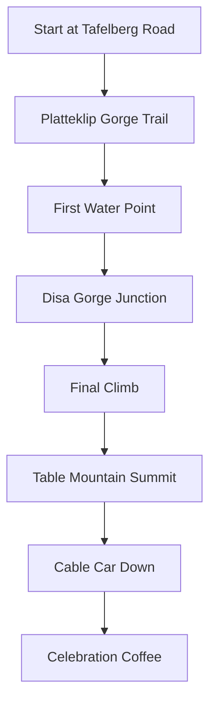

# My Cape Town Adventure

The Mother City has a way of capturing your heart and never quite letting go. This is the story of my recent weekend escape to one of Earth's most beloved destinations.

## Table of Contents

- [The Call of the City](#the-call-of-the-city)
- [Day 1: Table Mountain & Bo-Kaap](#day-1-table-mountain--bo-kaap)
- [Day 2: V&A Waterfront & Robben Island](#day-2-va-waterfront--robben-island)
- [Day 3: Cape Point & Penguins](#day-3-cape-point--penguins)
- [Travel Tips](#travel-tips)
- [Photo Gallery](#photo-gallery)

## The Call of the City

Sometimes you just need to pack a bag and go. After weeks of non-stop work and the general hustle of daily life, I felt that familiar pull—the mountain calling my name, the ocean whispering secrets, and the city's vibrant energy waiting to be experienced.

> "Cape Town is not just a place; it's a feeling." — Unknown

### Planning the Trip

I'm a firm believer that the best adventures happen with a mix of planning and spontaneity. Here's what I had on my itinerary:

| Day | Main Activity | Backup Plan |
|-----|---------------|-------------|
| 1 | Table Mountain hike | Cable car if weather bad |
| 2 | Robben Island tour | V&A Waterfront exploration |
| 3 | Cape Point drive | Boulders Beach penguins |

## Day 1: Table Mountain & Bo-Kaap

### Morning: Conquering the Mountain

There's something profoundly humbling about standing atop Table Mountain, looking out over a city nestled between mountain and sea. I chose to hike up via Platteklip Gorge—the most direct route, though not for the faint of heart.

**The Hike Stats:**
- **Distance**: 3km (one way)
- **Duration**: 2-3 hours up
- **Elevation gain**: ~600 meters
- **Difficulty**: Moderate to challenging

### The View from the Top

Words can't quite capture it, but I'll try:

The city sprawled below like a miniature model. The Atlantic Ocean shimmering in the distance. The iconic stadium looking like a white basket. And the famous "tablecloth" of clouds slowly rolling over the edge.

I sat there for what felt like hours, just breathing. This is why I travel. This is why I seek out these moments of awe.

### Afternoon: Bo-Kaap's Colorful Streets

After descending (I took the cable car down—my knees thanked me), I headed to Bo-Kaap, the historic Malay Quarter famous for its brightly colored houses and cobblestone streets.

**What I Loved:**
- 📸 Every corner is Instagram-worthy
- 🕌 The Bo-Kaap Museum tells powerful stories
- 🍛 Amazing Cape Malay cuisine
- 🎨 Rich cultural heritage

### Evening: Sunset at Signal Hill

No Cape Town trip is complete without watching the sunset from Signal Hill. I packed a picnic, found a spot away from the crowds, and watched as the sky transformed into a canvas of orange, pink, and purple.

## Day 2: V&A Waterfront & Robben Island

### Morning: A Journey to Robben Island

The ferry ride to Robben Island was calm, the morning sun reflecting off the water. But the destination holds heavy history—this is where Nelson Mandela spent 18 of his 27 years in prison.

**The Tour Experience:**
- ⏱️ Duration: 3.5 hours total
- 🚌 Bus tour led by former political prisoners
- 🏠 Visit to Mandela's cell
- 📚 Deeply moving and educational

> "Education is the most powerful weapon which you can use to change the world." — Nelson Mandela

Walking through the prison cells, hearing stories from someone who lived through it, was profoundly emotional. It's a reminder of the price of freedom and the power of forgiveness.

### Afternoon: V&A Waterfront Exploration

Back on the mainland, I wandered through the V&A Waterfront—a blend of historic harbor and modern entertainment.

**Highlights:**
- Shopping at the Watershed (local crafts!)
- Street performers and live music
- The Cape Wheel for panoramic views
- Countless dining options

### Evening: Dinner with a View

I treated myself to dinner at a waterfront restaurant, watching the boats bob in the harbor as I savored fresh seafood. Sometimes solitude is exactly what you need.

## Day 3: Cape Point & Penguins

### Morning: The Edge of Africa

Cape Point, where the Atlantic and Indian Oceans meet, is dramatic in that way that makes you feel wonderfully small. The cliffs, the crashing waves, the endless horizon—it's nature at its most magnificent.

**Getting There:**
- 🚗 2-hour drive from Cape Town
- 🅿️ Parking available at the reserve
- 🚡 Funicular optional (I walked—more fun!)

### The Lighthouse

I hiked up to the old lighthouse for the ultimate view. The path is steep but short, and the panorama is absolutely worth it.

### Afternoon: Penguins at Boulders Beach

No visit to the Cape Peninsula is complete without meeting the penguins! Boulders Beach is home to a colony of African penguins, and watching these tuxedoed characters waddle, swim, and squawk was the perfect end to my trip.

**Penguin Facts:**
- 🐧 African penguins are endangered
- 🏠 They nest in burrows or under rocks
- 🐟 They can dive up to 30 meters deep
- 💑 They mate for life

## Travel Tips

### Getting Around

| Option | Pros | Cons |
|--------|------|------|
| Rental car | Flexibility, convenience | Parking can be tricky |
| Uber/Bolt | No parking worries | Can add up cost-wise |
| MyCiTi bus | Affordable, scenic | Limited routes |
| Tour groups | Hassle-free | Less flexibility |

### Where to Stay

**Budget-Friendly:**
- Long Street backpackers
- Observatory hostels

**Mid-Range:**
- Gardens boutique hotels
- Sea Point guesthouses

**Luxury:**
- V&A Waterfront hotels
- Camps Bay resorts

### What to Pack

- ☀️ Sunscreen (the African sun is no joke)
- 🧥 Layers (weather changes quickly)
- 👟 Comfortable walking shoes
- 📷 Camera with extra batteries
- 💧 Reusable water bottle

### Safety Tips

Cape Town is generally safe for tourists, but like any major city, it's wise to:
- Stay aware of your surroundings
- Don't flash valuables
- Use reputable transport
- Avoid isolated areas at night
- Keep emergency numbers handy

## Photo Gallery

While I can't embed all my photos here, here are some of my favorite shots from the trip:

1. **Sunrise from Table Mountain** - The city waking up below
2. **Bo-Kaap Colors** - A rainbow of houses
3. **Robben Island Ferry** - Journey into history
4. **Cape Point Lighthouse** - Standing at the edge
5. **Penguin Parade** - Boulders Beach residents
6. **Signal Hill Sunset** - Nature's masterpiece

---

## Final Thoughts

Cape Town is one of those places that stays with you long after you've left. It's in the way the light hits the mountain at golden hour, the warmth of the people, the rich tapestry of cultures, and the constant reminder of both struggle and triumph.

I left feeling refreshed, inspired, and deeply grateful for the beauty that exists in our world. If you've never been, I can't recommend it enough. And if you have, you know exactly what I'm talking about.

**Until next time, Cape Town.** 🌊

---

*Have you been to Cape Town? I'd love to hear your favorite spots in the comments!*
