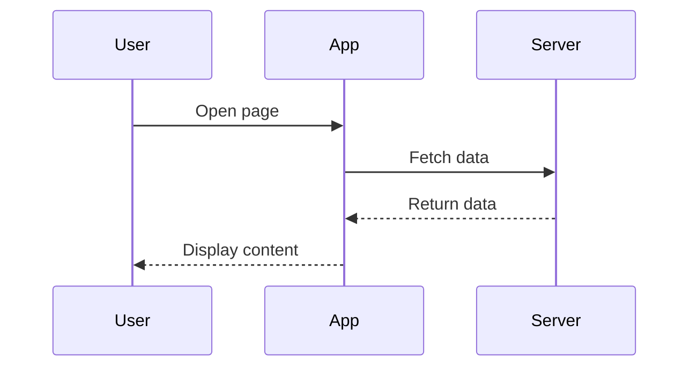

# Markdown Processing Plugins

This docs site includes three built-in plugins that process markdown syntax at build time. Each plugin transforms specific syntax into HTML that renders on the client.

## Live Examples

Below are **actual working examples** - these will render when you build the site:

### Math Notation

Inline math uses `$...$` syntax:

$E = mc^2$

$\alpha + \beta = \gamma$

Display math uses `$$...$$` syntax:

$$\int_0^\infty e^{-x} dx = 1$$

$$\vec{F} = m\vec{a}$$

### Admonitions

:::note
This is a note callout. Use it for general information.
:::

:::tip
This is a tip - helpful information to keep in mind.
:::

:::warning
This is a warning - pay attention to this!
:::

:::danger
This is danger - something critical to avoid!
:::

### Mermaid Diagrams

```mermaid:desc=A top-down flowchart demonstrating a decision tree with a start node, conditional branch, and two terminal states (Stop and Complete).
graph TD;
    A[Start] --> B{Decision}
    B -->|Yes| C[Proceed]
    B -->|No| D[Stop]
    C --> E[Complete]
```



```mermaid:desc=A pie chart visualizing the relative usage distribution of the three markdown plugins: Math (45%), Admonitions (30%), and Mermaid (25%).
pie title Plugin Usage
    "Math" : 45
    "Admonitions" : 30
    "Mermaid" : 25
```

## Plugin Interface

```typescript:desc=TypeScript interface defining the MarkdownPlugin contract, with optional preProcess and postProcess methods that transform raw markdown and generated HTML respectively during the build-time parsing pipeline.
interface MarkdownPlugin {
  name: string;
  preProcess?(md: string): string;   // Run before marked parses markdown
  postProcess?(html: string): string; // Run after marked produces HTML
}
```

## Pipeline Execution

```mermaid:desc=Sequence diagram showing the complete plugin execution pipeline with two phases: preProcess (math extracts $...$, admonitions extracts ::: blocks), then marked.parse converts to HTML, then postProcess in reverse order (mermaid wraps diagrams, admonitions renders callouts, math renders MathJax).
sequenceDiagram
    participant MD as Raw Markdown
    participant Math as Math Plugin
    participant Admin as Admonitions Plugin
    participant Mermaid as Mermaid Plugin
    participant Marked as marked.parse()
    participant HTML as Final HTML
    
    Note over MD,HTML: Phase 1: preProcess (in order)
    
    MD->>Math: preProcess(markdown)
    Math->>Math: Extract $...$ and $$...$$
    Math->>Math: Replace with sentinels
    Math->>Admin: Processed markdown
    
    Admin->>Admin: Extract ::: blocks
    Admin->>Admin: Replace with sentinels
    Admin->>Mermaid: Processed markdown

    Mermaid->>Mermaid: "Pass-through\n(no pre-processing)"
    Mermaid->>Marked: Ready for parsing

    Note over MD,HTML: Phase 2: marked.parse()

    Marked->>Marked: Convert to HTML
    Marked->>Marked: "Apply custom renderer\n(Shiki, headings, etc)"
    Marked->>Mermaid: Raw HTML

    Note over MD,HTML: Phase 3: postProcess (REVERSE order)

    Mermaid->>Mermaid: "Wrap mermaid codeblocks\nin .mermaid-diagram containers"
    Mermaid->>Admin: HTML with diagrams

    Admin->>Admin: "Render sentinels as\nstyled admonition HTML"
    Admin->>Math: HTML with callouts

    Math->>Math: "Replace sentinels with\nMathJax spans"
    Math->>HTML: Final rendered HTML
```

## 1. Math Plugin

Protects LaTeX math notation from being parsed as regular markdown.

**Inline:** `$E = mc^2$`

**Display:** `$$E = mc^2$$`

The plugin extracts math before marked runs, stores it as a sentinel, then restores it as MathJax-compatible HTML after.

## 2. Admonitions Plugin

Docusaurus-style callout blocks.

| Type | Icon | Description |
|-----|------|-------------|
| `:::note` | ℹ️ | General information |
| `:::tip` | 💡 | Helpful hint |
| `:::warning` | ⚠️ | Warning message |
| `:::danger` | 🚫 | Critical warning |

**Custom title:**
:::note=Important
Custom title example with **bold** support.
:::

## 3. Mermaid Plugin

Transforms ```mermaid code blocks into interactive diagrams.

```mermaid:desc=Example mermaid flowchart showing a simple data processing pipeline from input through processing to output and persistent storage result.
flowchart LR
    A[Input] --> B[Process]
    B --> C[Output]
    C --> D[(Result)]
```

The SVG rendering happens in the browser via Mermaid.js.

## Creating Custom Plugins

1. Create `scripts/plugins/my-plugin.ts`
2. Implement the `MarkdownPlugin` interface
3. Add to `scripts/plugins/index.ts`

```typescript:desc=Boilerplate template for creating a new markdown plugin. The preProcess method receives raw markdown and should return transformed markdown (before marked parsing). The postProcess method receives HTML and should return transformed HTML (after marked parsing).
import type { MarkdownPlugin } from './types.ts';

export const myPlugin: MarkdownPlugin = {
  name: 'my-plugin',

  preProcess(md: string): string {
    return md;
  },

  postProcess(html: string): string {
    return html;
  }
};
```