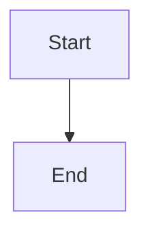
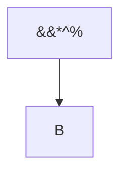
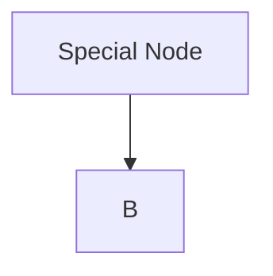
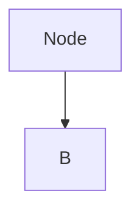

# Mermaid Diagram Validation Guide

## Overview

The project now includes **strict validation** for Mermaid diagram content to ensure all diagrams are properly formatted and contain valid syntax. This validation runs at **build-time** to catch issues before they reach production.

## What Gets Validated

### 1. **Empty Content**
- ❌ Rejects empty diagrams
- ❌ Rejects whitespace-only diagrams

### 2. **Invalid Characters & Patterns**
The validator rejects diagrams containing:
- ❌ HTML entities like `&#x26;`, `&amp;` (except allowed ones: `&amp;`, `&lt;`, `&gt;`, `&quot;`, `&apos;`, `&nbsp;`)
- ❌ Double-encoded ampersands: `&amp;&amp;`
- ❌ Hex escape sequences: `\x26`
- ❌ Unicode escape sequences: `\u0026`
- ❌ URL-encoded characters: `%26`

### 3. **Quote Validation**
- ❌ Empty quotes: `""` or `''`
- ❌ Whitespace-only quotes: `"  "`
- ❌ Special characters only: `"&&*^%"`
- ✅ Must contain alphanumeric characters (including Unicode)

### 4. **Balanced Brackets**
- ❌ Unbalanced braces: `{` vs `}`
- ❌ Unbalanced brackets: `[` vs `]`
- ❌ Unbalanced parentheses: `(` vs `)`

### 5. **Diagram Type Validation**
Must start with one of these valid types:
- ✅ `graph`, `flowchart`
- ✅ `sequenceDiagram`
- ✅ `classDiagram`, `classDiagram-v2`
- ✅ `stateDiagram`, `stateDiagram-v2`
- ✅ `erDiagram`
- ✅ `gantt`, `pie`, `mindmap`, `timeline`, `journey`
- ✅ `quadrantChart`, `xyChart`
- ✅ `requirementDiagram`
- ✅ `gitGraph`
- ✅ `sankey`
- ✅ `block`, `block-beta`
- ✅ `packet`, `packet-beta`
- ✅ `c4Context`, `c4Container`, `c4Component`, `c4Dynamic`, `c4Deployment`
- ✅ Directives: `%%{init: ...}%%`

## How It Works

### Build-Time Validation (Plugin)

When the mermaid plugin processes diagrams, it validates the content:

```typescript
// scripts/plugins/mermaid.ts
const validationErrors = validateMermaidContent(decoded);
if (validationErrors.length > 0) {
  // Shows error in the UI instead of rendering
  console.error(`Mermaid validation error(s) in diagram ${id}`);
  return errorContainer; // Shows validation error to user
}
```

### Validator Plugin

The validator runs during `bun run validate`:

```typescript
// scripts/plugins/validators/mermaid-validator.ts
export const mermaidValidator: MarkdownValidator = {
  name: "mermaid-content",
  label: "Mermaid Content Validator",
  isStrict: true, // Fails the build
  validate(content, filePath) {
    // Validates all mermaid blocks in the file
  }
};
```

## Running Validation

```bash
# Run all validators (including mermaid)
bun run validate

# Strict mode (exit on first error)
bun run validate:strict

# Show only statistics
bun run validate:stats

# LLM-friendly output
bun run validate:llm
```

## Common Errors & Fixes

### Error: "Invalid diagram type"

**Problem:**
```mermaid
package
    A --> B
```

**Fix:**


### Error: "Empty quotes detected"

**Problem:**
```mermaid
graph TD
    A[""] --> B
```

**Fix:**


### Error: "Quotes contain only special characters"

**Problem:**


**Fix:**


### Error: "Unbalanced brackets"

**Problem:**
```mermaid
graph TD
    A[Node --> B
```

**Fix:**


### Error: "HTML entity in diagram"

**Problem:**
```mermaid
graph TD
    A --> B&#x26;C
```

**Fix:**


## Testing

Run the validation tests:

```bash
# Quick test script
bun run scripts/test-mermaid-validation.ts

# Full test suite (when test framework is set up)
bun test tests/mermaid-validation.test.ts
```

## Files

- `scripts/plugins/validators/mermaid-content.ts` - Core validation logic
- `scripts/plugins/validators/mermaid-validator.ts` - Validator plugin
- `scripts/plugins/mermaid.ts` - Mermaid plugin with validation
- `scripts/test-mermaid-validation.ts` - Test script
- `tests/mermaid-validation.test.ts` - Unit tests

## Best Practices

1. **Always include a diagram type** - Start with `graph TD`, `flowchart LR`, etc.
2. **Use meaningful labels** - Don't leave quotes empty or with only special chars
3. **Balance all brackets** - Every `{` needs a `}`, every `[` needs a `]`
4. **Avoid HTML entities** - Use plain text instead of `&#x26;`, etc.
5. **Test locally** - Run `bun run validate` before committing

## Future Enhancements

Potential improvements to the validation system:

- [ ] Integrate with Mermaid's own parser for deeper syntax validation
- [ ] Add diagram-specific validations (e.g., sequence diagram message format)
- [ ] Provide auto-fix suggestions
- [ ] Check for common anti-patterns (e.g., circular dependencies)
- [ ] Validate node connections in graph diagrams
