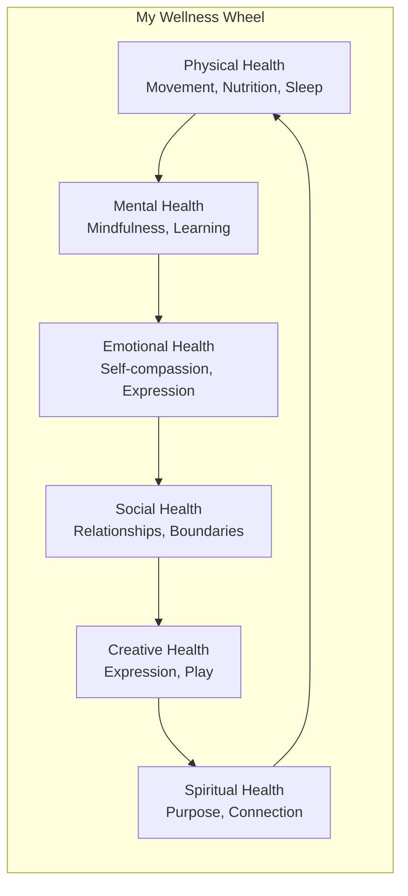
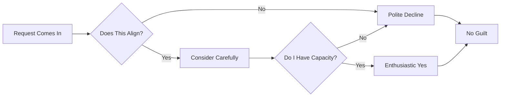
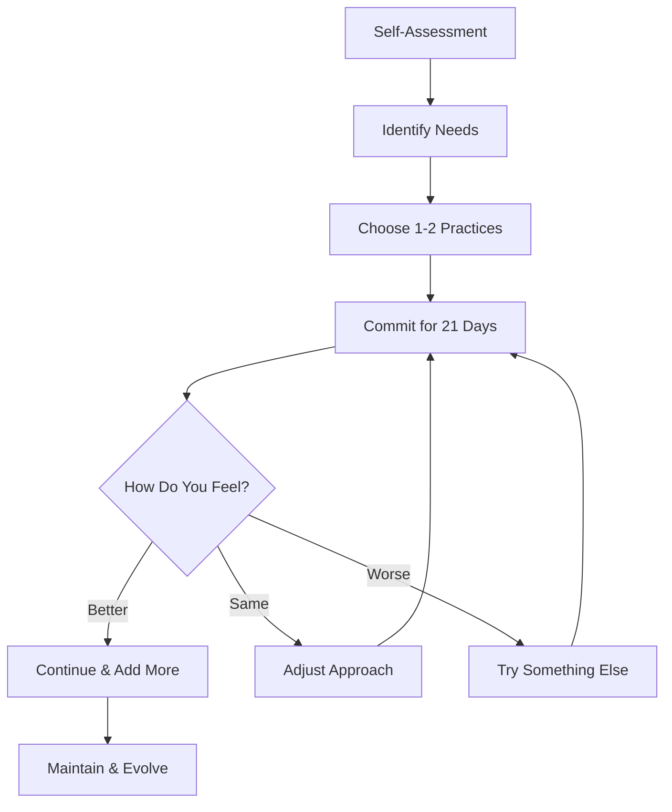

# Finding Balance: My Wellness Journey

In a world that glorifies busy, choosing balance is a radical act of self-love. This is my story of learning to slow down, breathe deeper, and live more intentionally.

## Table of Contents

- [The Wake-Up Call](#the-wake-up-call)
- [What Wellness Means to Me](#what-wellness-means-to-me)
- [My Daily Rituals](#my-daily-rituals)
- [Lessons Learned](#lessons-learned)
- [Tips for Your Journey](#tips-for-your-journey)

## The Wake-Up Call

It happened on an ordinary Tuesday. I was rushing from one commitment to another, running on caffeine and determination, when my body essentially said: *Enough.*

I woke up exhausted despite eight hours of sleep. My mind was foggy. My creativity—the thing I've always relied on—felt distant. I was doing all the things, checking all the boxes, but I wasn't *living*—I was surviving.

> "Rest is not idle, is not wasteful. Sometimes rest is the most productive thing you can do." — Unknown

### Signs I Was Out of Balance

Looking back, the warning signs were there:

| Symptom | What I Ignored |
|---------|----------------|
| Constant fatigue | "I'll sleep when I'm done" |
| Creative block | "I just need to push through" |
| Irritability | "It's just stress" |
| Poor sleep | "I'll relax later" |
| Skipping meals | "I'm too busy" |

Sound familiar? You're not alone.

## What Wellness Means to Me

Wellness isn't about perfect green smoothies, expensive yoga retreats, or having a pristine home (though those things can be nice). 

**True wellness is:**
- 🧠 **Mental clarity** - Knowing what matters and letting go of the rest
- 💪 **Physical vitality** - Moving your body in ways that feel good
- 💝 **Emotional balance** - Allowing all feelings without being consumed by them
- 🌱 **Spiritual connection** - Feeling part of something bigger
- 🤝 **Social nourishment** - Relationships that energize rather than drain

### The Wellness Wheel

Wellness is holistic. When one area suffers, others feel it. When one thrives, others benefit.

## My Daily Rituals

I'm a firm believer that small, consistent actions create big changes. Here are the rituals that transformed my life:

### Morning Routine (The Foundation)

**5:30 AM - Wake Up**
- No phone for the first hour (game-changer!)
- Glass of water with lemon
- 5 minutes of gratitude journaling

**6:00 AM - Movement**
- 20 minutes of yoga or stretching
- Sometimes a walk around the neighborhood
- Always listening to my body

**6:30 AM - Mindfulness**
- 10 minutes of meditation
- Setting intentions for the day
- Breathing exercises

**7:00 AM - Nourishment**
- Nutritious breakfast (usually something with protein)
- Herbal tea or coffee, enjoyed slowly
- Reading or quiet time

### Evening Routine (The Unwind)

**8:00 PM - Digital Sunset**
- Screens off or on night mode
- Dimming the lights
- Calming music or silence

**9:00 PM - Reflection**
- Journaling about the day
- Three things I'm grateful for
- Releasing what didn't serve me

**9:30 PM - Preparation**
- Skincare routine (self-care, not chore)
- Preparing for tomorrow
- Reading a few pages

**10:00 PM - Sleep**
- Cool, dark room
- No caffeine after 2 PM
- Consistent bedtime

## Lessons Learned

### 1. Balance Isn't Perfect

I used to think balance meant equal time for everything. Now I know it's about **flexibility**—some days work needs more, some days rest does.

> "Balance is not something you find, it's something you create." — Jana Kingsford

### 2. Rest Is Productive

This was hard to learn. But rest isn't laziness—it's essential for:
- Creative problem-solving
- Emotional regulation
- Physical recovery
- Mental clarity

### 3. Boundaries Are Love

Saying no to others often means saying yes to yourself. Boundaries aren't walls; they're gates with you as the gatekeeper.

**My Boundary Framework:**

### 4. Comparison Is the Thief of Joy

Social media makes it easy to compare my behind-the-scenes to everyone else's highlight reel. I've learned to:
- Limit social media time
- Follow accounts that inspire, not diminish
- Remember: everyone struggles

### 5. Small Steps Create Big Changes

You don't need a complete life overhaul. Start small:
- One extra glass of water
- Five minutes of stretching
- One deep breath before reacting

## Tips for Your Journey

### Start Here

| If You're Struggling With... | Try This First |
|------------------------------|----------------|
| Exhaustion | Prioritize sleep for one week |
| Stress | 5 minutes of deep breathing daily |
| Overwhelm | Write down top 3 priorities daily |
| Disconnection | Reach out to one friend this week |
| Creative block | Consume inspiring content daily |

### My Favorite Wellness Tools

**Apps I Love:**
- 📱 Headspace - Guided meditation
- 📱 Daylio - Mood tracking
- 📱 Forest - Focus and phone detox
- 📱 Insight Timer - Free meditation library

**Books That Changed Me:**
- "Atomic Habits" by James Clear
- "The Power of Now" by Eckhart Tolle
- "Breath" by James Nestor
- "Why We Sleep" by Matthew Walker

**Simple Practices:**
- Morning pages (stream of consciousness writing)
- Weekly nature walks
- Digital sabbaths (one day screen-free)
- Gratitude jar
- Monthly self-care Sundays

### Creating Your Own Routine

Don't copy mine exactly—create what works for YOU:

1. **Assess your current state** - Where are you now?
2. **Identify your needs** - What's missing?
3. **Start small** - One or two changes at a time
4. **Be consistent** - Daily practice beats perfection
5. **Adjust as needed** - Listen to your body

## The Reality Check

Let me be honest: I don't get it perfect every day. Some days I sleep in. Some days I eat takeout. Some days I scroll mindlessly for an hour.

**And that's okay.**

Wellness isn't about perfection—it's about **awareness** and **course correction**. It's about noticing when you're off balance and gently guiding yourself back.

## A Note on Mental Health

Wellness includes mental health, and sometimes we need professional support. There's no shame in:
- Seeing a therapist
- Taking prescribed medication
- Asking for help
- Taking mental health days

Your mental health matters just as much as your physical health.

## Moving Forward

My wellness journey is ongoing. Some days are easier than others. But I've learned that the practices I've built are like anchors—they keep me steady when life gets stormy.

I invite you to start your own journey. Not tomorrow, not next Monday—today. With one small step. One deep breath. One moment of choosing yourself.

You're worth it.

---

**Your Turn:** What's one small wellness practice you could start today? Share in the comments—I'd love to cheer you on!

💝 *Remember: Progress, not perfection.*
