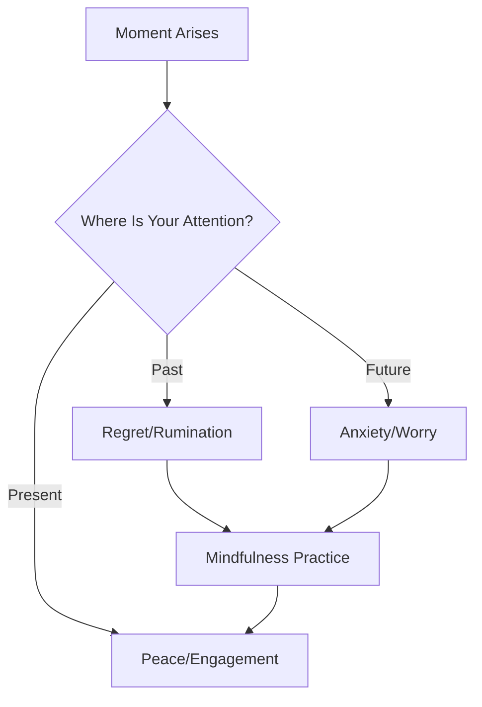
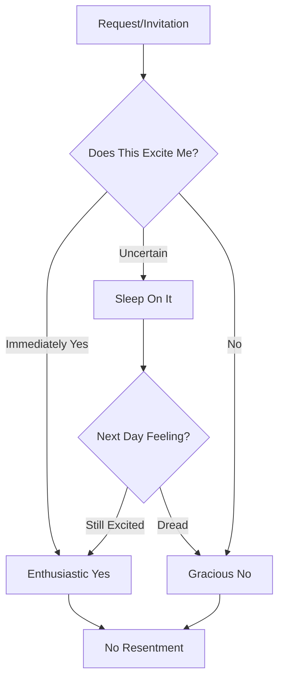

# The Art of Slow Living

In a culture that celebrates hustle, choosing slow is revolutionary. Here's how I learned to do less and live more.

## Table of Contents

- [What Is Slow Living?](#what-is-slow-living)
- [Why I Chose Slow](#why-i-chose-slow)
- [Principles of Slow Living](#principles-of-slow-living)
- [Practical Steps](#practical-steps)
- [The Beauty of Constraints](#the-beauty-of-constraints)
- [Your Slow Living Journey](#your-slow-living-journey)

## What Is Slow Living?

Slow living isn't about doing everything at a snail's pace. It's not laziness or lack of ambition. 

**Slow living is intentional living.**

It's about:
- 🐌 Doing things at the right speed, not the fastest
- 🎯 Prioritizing what matters, eliminating the rest
- 🌿 Savoring experiences instead of rushing through them
- 💭 Being present instead of perpetually distracted
- 🏡 Creating a life that feels good on the inside

> "Slow living is not about doing everything slowly. It's about doing everything at the right speed." — Unknown

### What Slow Living Is NOT

| Myth | Reality |
|------|---------|
| Being unproductive | Being intentionally productive |
| Having no goals | Having meaningful goals |
| Never being busy | Choosing when to be busy |
| Rejecting technology | Using technology mindfully |
| Living in isolation | Cultivating quality connections |

## Why I Chose Slow

My fast life looked successful from the outside:
- Packed calendar ✓
- Multiple projects ✓
- Always "on" ✓
- Exhausted but proud ✓

But inside, I was running on empty.

### The Breaking Point

I realized I hadn't truly *enjoyed* anything in months. I'd rush through experiences, already thinking about the next thing. I was collecting moments but not savoring them.

> "Almost everything will work again if you unplug it for a few minutes, including you." — Anne Lamott

### The Turning Point

One Sunday, I deliberately did nothing for an entire day. No plans, no productivity, no pressure. Just... being.

And something shifted.

I remembered what it felt like to:
- Read a book without checking my phone
- Drink coffee while watching the sunrise
- Think without distraction
- Simply exist without justification

## Principles of Slow Living

### 1. Intentionality

Everything I do is a choice. When I act with intention, I'm no longer on autopilot.

**Questions I Ask Myself:**
- Why am I doing this?
- Does this align with my values?
- What would happen if I didn't do this?
- Is this the best use of my time and energy?

### 2. Presence

Being here, now. Not dwelling on the past or worrying about the future.

### 3. Simplicity

Less clutter, less noise, less everything that doesn't serve me.

**Areas I Simplified:**
- 🏠 Physical space (decluttering)
- 📱 Digital space (apps, notifications)
- 📅 Calendar (commitments)
- 🧠 Mental space (inputs, worries)
- 💬 Social (quality over quantity)

### 4. Quality Over Quantity

One meaningful experience beats ten shallow ones.

| Instead Of... | I Choose... |
|---------------|-------------|
| 10 casual acquaintances | 3 deep friendships |
| Scrolling 100 posts | Reading one good article |
| 5 rushed meals | 1 mindful meal |
| 10 mediocre projects | 1 excellent project |
| Busy every day | Margin for rest |

### 5. Connection

To myself, to others, to nature, to something bigger.

## Practical Steps

### Start Small

You don't need to quit your job and move to a cabin (unless you want to!). Here are gentle ways to begin:

#### Morning Adjustments

**Before:**
- ⏰ Alarm, immediately check phone
- 🏃 Rush through morning
- ☕ Coffee while multitasking
- 📱 Social media with breakfast

**After:**
- ⏰ Alarm, 5 minutes of breathing
- 🧘 Gentle stretching
- ☕ Coffee, just coffee
- 📖 Reading or journaling

#### Evening Adjustments

**Before:**
- 💻 Work until dinner
- 📺 Mindless TV scrolling
- 📱 Phone in bed
- 😴 Exhausted collapse into sleep

**After:**
- 🕐 Work ends at a set time
- 📖 Reading or gentle activity
- 📵 No screens before bed
- 😴 Peaceful transition to sleep

### The Art of Saying No

This was my hardest lesson. Here's my framework:

### Creating Margin

Margin is the space between commitments. It's where life happens.

**How I Create Margin:**
- Buffer time between appointments (15 min minimum)
- One day per week with no plans
- Not scheduling every evening
- Leaving projects at 80% sometimes (perfectionism is exhausting)
- Defaulting to "no" when uncertain

## The Beauty of Constraints

Paradoxically, constraints create freedom. When I limit my options, I focus my energy.

### My Constraints

| Area | Constraint | Result |
|------|------------|--------|
| Phone | No social media before noon | Better mornings |
| Work | No emails after 6 PM | Better evenings |
| Commitments | Max 3 per week | More presence |
| Projects | Max 2 major projects | Better quality |
| Shopping | 30-day waiting period | Less clutter |

### The 80/20 Rule

80% of my fulfillment comes from 20% of my activities. Identifying that 20% was transformative.

**My 20%:**
- Creating content I'm proud of
- Deep conversations with loved ones
- Time in nature
- Reading and learning
- Rest and restoration

## Your Slow Living Journey

### Questions for Reflection

Grab a journal and explore:

1. What does "enough" look like to me?
2. Where am I rushing that I could slow down?
3. What commitments drain me? Which energize me?
4. What would I do if I couldn't post about it?
5. When do I feel most alive and present?

### A 7-Day Slow Living Challenge

| Day | Practice |
|-----|----------|
| 1 | No phone for first hour after waking |
| 2 | Eat one meal without any distractions |
| 3 | Take a 15-minute walk without destination |
| 4 | Say no to one non-essential commitment |
| 5 | Spend 30 minutes in nature |
| 6 | Do one thing with full attention (no multitasking) |
| 7 | Digital sunset—no screens after 8 PM |

### Common Obstacles (And Solutions)

**"I don't have time"**
→ Start with 5 minutes. Everyone has 5 minutes.

**"My job requires me to be fast"**
→ Slow living is about *how* you do things, not speed of completion.

**"I'll fall behind"**
→ Behind whom? You're running your own race.

**"People will think I'm lazy"**
→ Their opinion matters less than your wellbeing.

**"I've tried before and failed"**
→ This isn't failure—it's practice. Try again, gentler.

## The Ripple Effect

When I slowed down, something unexpected happened:

- My work improved (more focus = better quality)
- My relationships deepened (more presence = more connection)
- My creativity returned (space = inspiration)
- My health improved (less stress = better body function)

> "When you slow down, you don't accomplish less—you accomplish with greater intention." — Unknown

## A Letter to My Former Fast-Living Self

Dear Hurried Me,

I know you think speed equals success. I know you believe rest is for later. I know you're afraid that slowing down means falling behind.

But I promise you: the best things in life can't be rushed.

The perfect cup of tea.
The deep conversation with a friend.
The creative breakthrough.
The moment of clarity.
The feeling of truly being alive.

None of these happen at speed.

Trust me. Slow down. You won't miss out—you'll finally be present for what matters.

With love,  
Your Slower Self

---

**Your Invitation:** Choose one area of your life to slow down this week. Just one. Notice what happens.

🌿 *Slow is smooth. Smooth is fast. And peaceful is priceless.*
