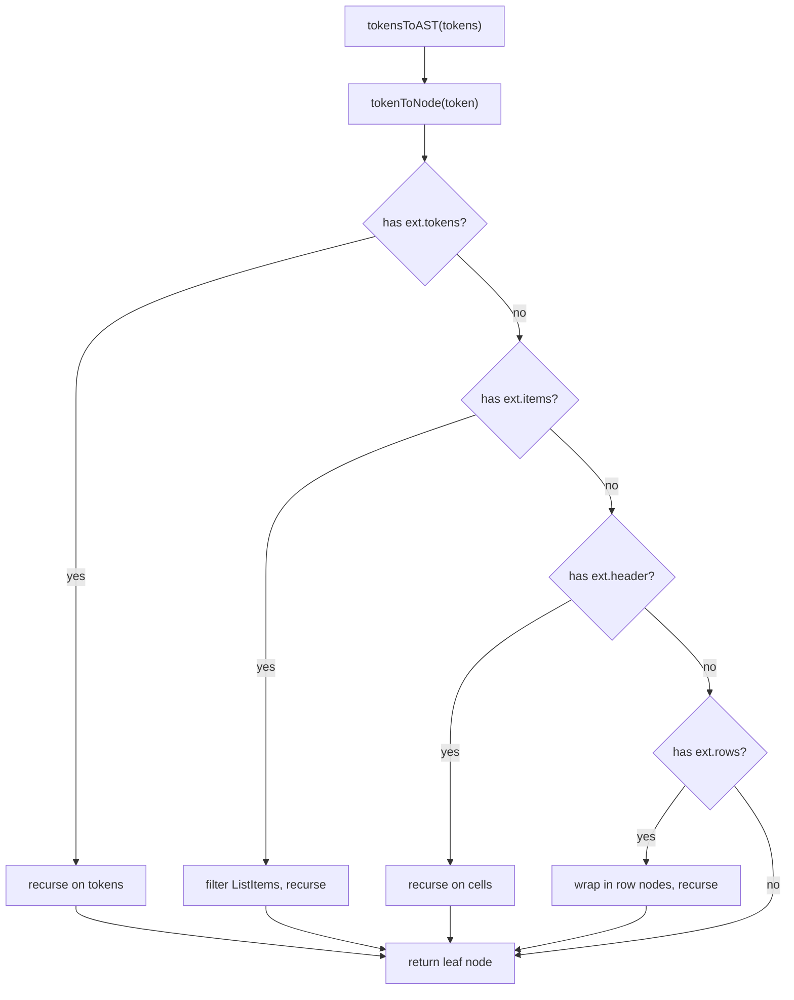
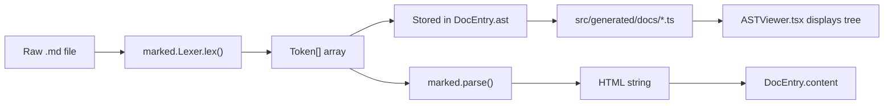

# AST Parser

The AST parser module (`src/ast-parser.ts`) provides utilities for inspecting and analyzing the token tree produced by marked.js. It converts the flat token array into a simplified tree structure and offers helper functions for counting, classification, and depth measurement.

## Token Types from marked

Marked.js produces tokens for each block-level element in markdown:

| Token Type | Description | Example |
|---|---|---|
| `heading` | Headings (h1-h6) | `# Title` |
| `paragraph` | Text paragraphs | `Some text here` |
| `code` | Fenced code blocks | `\`\`\`ts ... \`\`\`` |
| `list` | Ordered and unordered lists | `- item` or `1. item` |
| `table` | GFM tables | `\| col \| col \|` |
| `blockquote` | Quoted text | `> quoted` |
| `html` | Raw HTML blocks | `<div>...</div>` |
| `hr` | Horizontal rules | `---` |
| `text` | Raw text segments | Inline content |

## Type Definitions

### ExtendedToken

A type union that adds optional fields to marked's base `Token` type so that subtype-specific properties are accessible without type casting:

```ts
type ExtendedToken = Token & {
  raw?: string;       // Raw markdown text
  text?: string;      // Rendered text content
  depth?: number;     // Heading level (1-6)
  lang?: string;      // Code block language
  tokens?: Token[];   // Nested tokens (e.g., inside paragraphs)
  items?: (Tokens.ListItem | string)[]; // List items
  header?: Tokens.TableCell[];          // Table header cells
  rows?: Tokens.TableCell[][];          // Table body rows
  ordered?: boolean;  // Whether list is ordered
  start?: number;     // Start number for ordered lists
  loose?: boolean;    // Whether list has blank lines between items
};
```

### ASTTokenNode

A simplified tree node used for display and analysis:

```ts
export interface ASTTokenNode {
  type: string;       // Token type name (e.g., "heading", "paragraph")
  raw?: string;
  text?: string;
  depth?: number;
  lang?: string;
  tokens?: Token[];
  items?: Token[];
  header?: Token[];
  rows?: Token[][];
  ordered?: boolean;
  start?: number;
  loose?: boolean;
  children?: ASTTokenNode[];  // Nested child nodes
}
```

## Core Functions

### tokensToAST

Converts a flat `Token[]` array from marked into a tree of `ASTTokenNode[]`:

```ts
export function tokensToAST(tokens: Token[]): ASTTokenNode[]
```

The function recursively processes each token and nests children based on the token type:

- `tokens` arrays become `children`
- `items` arrays (from lists) are filtered to `ListItem` objects and converted
- `header` cells become children
- `rows` are wrapped in a `"row"` node type with cell children



### countNodes

Counts the total number of nodes in the AST tree:

```ts
export function countNodes(ast: ASTTokenNode[]): number
```

Recursively sums 1 for each node plus the count of all its children:

```ts
// Example: a document with 1 heading + 1 paragraph + 1 code block
// countNodes returns 3
```

### getUniqueTypes

Returns a sorted array of all unique token type names found in the AST:

```ts
export function getUniqueTypes(ast: ASTTokenNode[]): string[]
```

```ts
// Example output: ["code", "heading", "list", "paragraph", "table"]
```

Useful for quickly understanding what kinds of elements a document contains.

### getASTDepth

Returns the maximum nesting depth of the AST:

```ts
export function getASTDepth(ast: ASTTokenNode[]): number
```

```ts
// A flat document with only top-level tokens returns 1
// A document with a list containing nested code returns 2+
```

## ASTViewer Component

`ASTViewer.tsx` is a React component that displays the AST tree in a collapsible format. It is intended for **debugging only** and is not used in standard production builds.

The component:

- Receives `DocEntry.ast` tokens as input
- Calls `tokensToAST` to build the tree
- Displays nodes with `countNodes`, `getUniqueTypes`, and `getASTDepth` statistics
- Renders a tree view with expand/collapse for each node

Access it in the application via the AST viewer button in the top bar. It is gated behind a debug-only toggle so it does not appear in normal documentation viewing.

## Usage Example

```ts
import { tokensToAST, countNodes, getUniqueTypes, getASTDepth } from "./ast-parser";

// Get tokens from marked
const tokens = marked.Lexer.lex(markdownContent);

// Convert to tree
const ast = tokensToAST(tokens);

// Analyze
const total = countNodes(ast);
const types = getUniqueTypes(ast);
const depth = getASTDepth(ast);

console.log(`${total} nodes, types: ${types.join(", ")}, depth: ${depth}`);
```

## Pipeline Integration

The AST data flows through the build pipeline as follows:



The `ast` field is stored alongside `content` in each `DocEntry` but is **optional** (`ast?: any[]`). It is only populated when the build script explicitly includes lexer tokens.

## Cross-References

- [Generated Output](./01-generated-output.md) -- `DocEntry.ast` field stores the token array
- [Markdown Plugins API](./04-markdown-plugins-api.md) -- plugins run before and after `marked` parsing
- [File Structure](./05-file-structure.md) -- location of `src/ast-parser.ts` in the project
