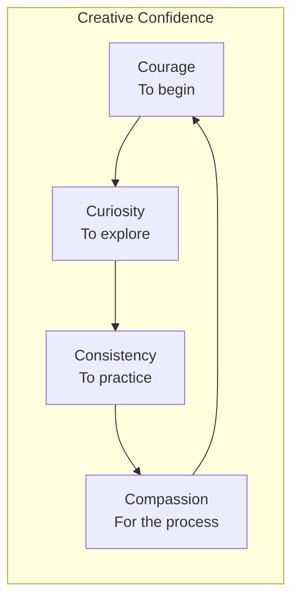
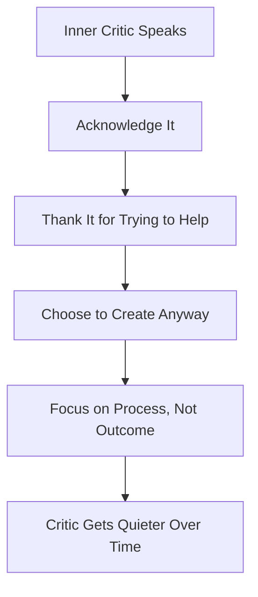
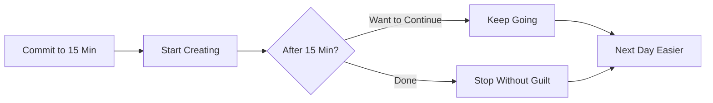
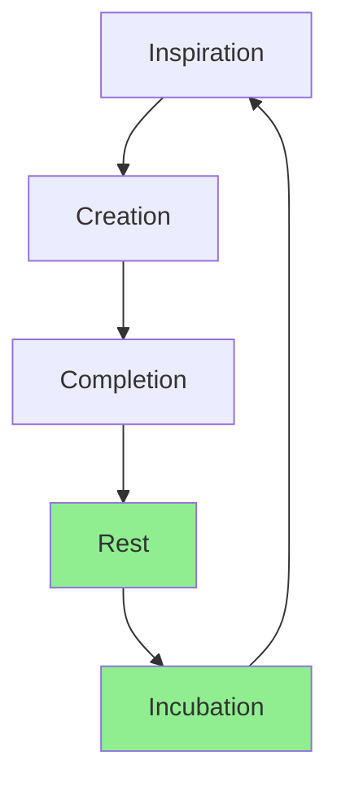

# Creative Confidence: Unlocking Your Inner Artist

Creativity isn't a talent—it's a way of living. Here's how I rediscovered my creative voice and learned that everyone is an artist.

## Table of Contents

- [The Creativity Myth](#the-creativity-myth)
- [My Creative Awakening](#my-creative-awakening)
- [What Is Creative Confidence?](#what-is-creative-confidence)
- [Blocks to Creativity](#blocks-to-creativity)
- [Building Creative Confidence](#building-creative-confidence)
- [Daily Creative Practice](#daily-creative-practice)
- [Your Creative Journey](#your-creative-journey)

## The Creativity Myth

Here's what I used to believe:

> "Some people are born creative. I'm not one of them."

Sound familiar? This myth keeps so many of us from exploring our creative potential.

### The Truth About Creativity

| Myth | Truth |
|------|-------|
| Creativity is a gift | Creativity is a practice |
| Artists are special | Everyone creates |
| You need talent | You need curiosity |
| It's about the product | It's about the process |
| Perfection is the goal | Expression is the goal |

> "Creativity is not a talent. It is a way of operating." — John Cleese

### Creativity Is Human

Think about it:
- Cooking dinner = creativity
- Decorating your space = creativity
- Problem-solving at work = creativity
- Telling stories to friends = creativity
- Gardening = creativity
- Parenting = creativity

We're all creators. We just forgot.

## My Creative Awakening

### The Childhood Artist

As a kid, I created without hesitation:
- 🎨 Doodles on every surface
- 📝 Stories in colorful notebooks
- 🎭 Dramatic performances for family
- 🏗️ Forts built from furniture
- 🎵 Songs made up on the spot

No fear. No judgment. Just pure expression.

### The Lost Years

Then somewhere along the way:
- Someone said my drawing wasn't "right"
- Someone said I should be "practical"
- I compared my work to "real artists"
- I started valuing productivity over play
- I forgot what it felt like to create for joy

### The Return

My creative reawakening happened accidentally:

I bought a cheap watercolor set "for fun." My first attempts were... not good. But something magical happened—I didn't care. I was having *fun*.

> "The desire to create is one of the deepest yearnings of the human soul." — Dieter F. Uchtdorf

That's when I remembered: **Creativity isn't about being good. It's about being alive.**

## What Is Creative Confidence?

Creative confidence is the belief that you can make something meaningful.

### The Four Components

### Courage
The willingness to start before you're ready.

### Curiosity  
The desire to explore without knowing the outcome.

### Consistency
Showing up even when inspiration doesn't.

### Compassion
Being kind to yourself when it doesn't work out.

## Blocks to Creativity

### The Inner Critic

We all have one. Mine sounds suspiciously like my seventh-grade art teacher.

**Common Critic Statements:**
- "This isn't good enough"
- "Someone already did this better"
- "What's the point?"
- "You're wasting time"
- "Real artists don't struggle like this"

### Taming the Critic

Instead of fighting the critic, I learned to acknowledge it:

**My Response to the Critic:**
> "I hear you. You're trying to protect me from judgment. But I'm creating anyway, because this matters to me."

### Other Common Blocks

| Block | What It Feels Like | Antidote |
|-------|-------------------|----------|
| Perfectionism | "It must be flawless" | Done is better than perfect |
| Comparison | "They're so much better" | Compare only to your past self |
| Fear | "What if people hate it?" | Create for yourself first |
| Overwhelm | "I don't know where to start" | Tiny first step |
| Impatience | "I should be better by now" | Trust the process |

## Building Creative Confidence

### Start Before You're Ready

This is the secret. There is no "ready."

**My First Projects:**
- Terrible poems no one saw
- Blurry photos I kept anyway
- Ugly pottery I'm proud of
- Bad drawings that taught me something

Every master was once a disaster. The difference? They kept going.

### Create a Safe Space

I have a corner of my home where:
- Mess is allowed
- Judgment doesn't enter
- Experiments are celebrated
- "Failures" are just data

You need this space too. It can be:
- A physical corner
- A digital folder
- A time of day
- A mindset

### The Power of Constraints

Paradoxically, limitations boost creativity:

**Try These:**
- Create with only 3 colors
- Write in exactly 100 words
- Photograph only things within 1 meter
- Draw with your non-dominant hand
- Make art in 10 minutes

Constraints force creative problem-solving.

## Daily Creative Practice

### My Morning Pages

Every morning, I write 3 pages of stream-of-consciousness thoughts.

**Rules:**
1. Write without stopping
2. Don't edit or judge
3. Don't show anyone
4. Just let it flow

This practice:
- Clears mental clutter
- Uncovers hidden ideas
- Builds creative muscle
- Starts the day centered

### The 15-Minute Rule

I commit to just 15 minutes of creative time daily.

**Why It Works:**
- Low barrier to entry
- Builds consistency
- Often leads to longer sessions
- Removes the pressure of "big projects"

### Weekly Creative Dates

Once a week, I have a creative date with myself:
- 1-2 hours of uninterrupted time
- No agenda or expectations
- Just exploration and play
- Often my best ideas emerge here

## Finding Your Medium

Not sure what to create? Try this:

### The Curiosity Audit

Ask yourself:

1. **What did I love as a child?**
   - Drawing? Writing? Building? Performing?

2. **What do I enjoy consuming?**
   - Love reading? Try writing.
   - Love galleries? Try painting.
   - Love concerts? Try music.

3. **What makes me lose track of time?**
   - This is a clue to your creative flow

4. **What would I do if I couldn't fail?**
   - The fear points to the passion

### Permission to Dabble

You don't have to pick one thing forever. I've been:
- A photographer (still am!)
- A poet (sometimes still)
- A potter (terrible but joyful)
- A gardener (ongoing experiment)
- A cook (deliciously learning)

**Dabbling is not quitting—it's exploring.**

## The Creative Cycle

Understanding this saved my sanity:

**The phases:**

1. **Inspiration** - The spark, the idea
2. **Creation** - The work, the flow
3. **Completion** - Finishing, sharing
4. **Rest** - Recovery, emptiness (this is normal!)
5. **Incubation** - Subconscious processing

Most people quit at Rest, thinking they've lost their creativity. They haven't—they're just in a necessary phase.

## Sharing Your Work

This is scary. Do it anyway.

### Why Share?

- Connects you with others
- Creates accountability
- Inspires someone else
- Completes the creative cycle
- Builds confidence

### Start Small

- Share with one trusted friend
- Post in a supportive community
- Create a private Instagram for your work
- Join a local creative group
- Start a blog (like this one!)

> "You don't have to be great to start, but you have to start to be great." — Zig Ziglar

## Your Creative Journey

### Questions for Reflection

1. When did I stop creating?
2. What creative activities did I love as a child?
3. What's one tiny creative act I could do today?
4. What would I create if no one would ever see it?
5. What's stopping me? (Be honest)

### A 7-Day Creative Challenge

| Day | Practice |
|-----|----------|
| 1 | Doodle for 5 minutes (stick figures count!) |
| 2 | Write a 6-word story |
| 3 | Take one photo of something beautiful |
| 4 | Make something with your hands |
| 5 | Rearrange something in your space |
| 6 | Try a creative activity you've never done |
| 7 | Share something you created (anywhere) |

### Remember This

- Your creativity is valid, regardless of skill
- The world needs your unique perspective
- Done is better than perfect
- Comparison kills creativity
- Play is productive
- You're allowed to make bad art
- The process is the point

---

## A Letter to Aspiring Creators

Dear Beautiful Soul,

I know you're afraid. I know the critic is loud. I know you're worried it won't be good enough.

Create anyway.

Not because you'll be discovered. Not because you'll be famous. Not because you'll be the best.

Create because it makes you feel alive. Because the world needs what only you can make. Because your future self will thank you.

Start messy. Start small. Start scared. Just start.

You're an artist. I promise.

With belief in you,  
*Naranyala*

---

**Your Turn:** What's one tiny creative thing you'll do today? Tell me in the comments—I'm cheering for you!

🎨 *Remember: Every artist was first an amateur. Every masterpiece began as a mess. Begin anyway.*
