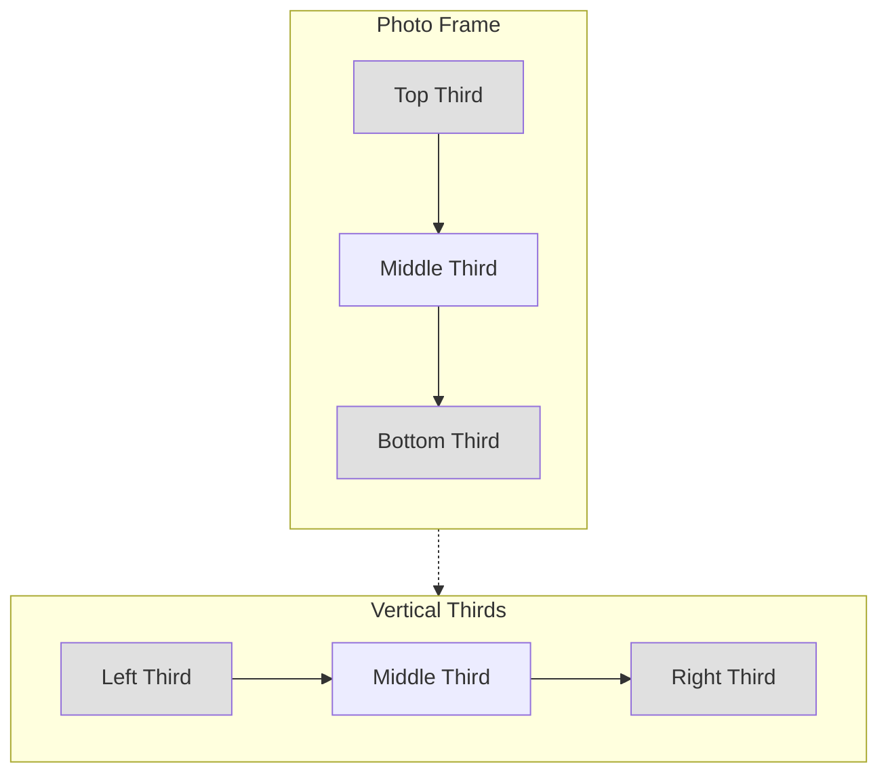
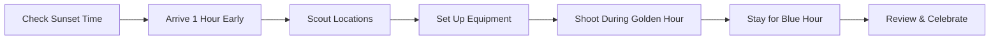
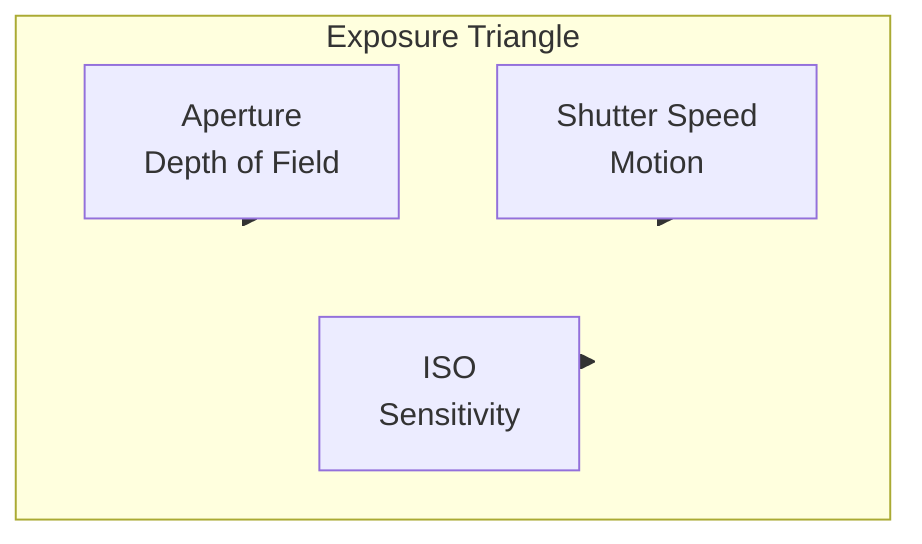
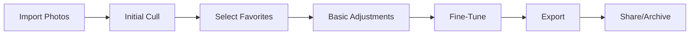

# The Photography Bug: Capturing Life's Beautiful Moments

Photography changed how I see the world. Here's my journey from point-and-shoot to finding beauty in everyday moments.

## Table of Contents

- [How It Started](#how-it-started)
- [Why Photography?](#why-photography)
- [My Gear Journey](#my-gear-journey)
- [Finding Your Eye](#finding-your-eye)
- [Composition Basics](#composition-basics)
- [The Magic of Golden Hour](#the-magic-of-golden-hour)
- [Street Photography Adventures](#street-photography-adventures)
- [Tips for Beginners](#tips-for-beginners)

## How It Started

I didn't set out to become a photographer. It happened accidentally.

### The First Camera

My first "real" camera was a hand-me-down DSLR from a friend who was upgrading. It was heavy, complicated, and I had no idea what I was doing.

**My First Photos:**
- Blurry shots of my coffee
- Overexposed pictures of the sky
- Random objects around my apartment
- A lot of accidental butt-dial photos (the camera was always on)

> "Your first 10,000 photographs are your worst." — Ansel Adams

I now know Ansel Adams was being generous. My first 10,000 were truly terrible.

### The Moment It Clicked

Then one evening, I captured something magical:

Golden light streaming through my kitchen window. Dust particles dancing in the beam. A simple moment, but through the lens, it looked... extraordinary.

That's when I realized: **Photography isn't about the camera. It's about seeing.**

## Why Photography?

### It Slows Me Down

In a fast world, photography forces me to pause:
- To notice the light
- To observe the details
- To appreciate the moment
- To be present

### It Changes My Perspective

Suddenly, I'm looking at:
- How light falls on a wall
- The geometry of buildings
- Expressions on strangers' faces
- Patterns in nature
- Colors I never noticed

### It Preserves Memories

Photos are time machines. They transport me back to:
- The smell of rain that day
- The feeling of being there
- The conversation I was having
- The person I was then

## My Gear Journey

### What I've Used

| Camera | When | What I Learned |
|--------|------|----------------|
| Smartphone | Still use! | Best camera is the one you have |
| Entry DSLR | First "real" camera | Technical basics |
| Mirrorless | Current daily | Portability matters |
| Film camera | Weekend fun | Intentionality |
| Drone | Special occasions | New perspectives |

### Current Setup

**For Daily Carry:**
- 📷 Mirrorless camera with 35mm lens
- 📱 Smartphone (always with me)
- 🎒 Small, comfortable bag

**For Special Shoots:**
- 📷 Full-frame mirrorless
- 🔍 Multiple lenses (24-70mm, 50mm, 85mm)
- 🎯 Tripod for long exposures
- 🔋 Extra batteries (always!)

### The Truth About Gear

**Expensive gear doesn't make you better.**

I've seen stunning photos from:
- iPhone photographers
- Disposable cameras
- Old film cameras
- Budget DSLRs

And boring photos from:
- Top-of-the-line cameras
- Every lens imaginable
- Perfect lighting setups

**Your eye matters more than your equipment.**

## Finding Your Eye

### What Makes a Photo "Yours"?

Your style isn't something you choose—it's something that emerges.

**My Style Evolved Through:**
- Shooting what I love (not what's trendy)
- Editing consistently (similar tones, colors)
- Studying photographers I admire
- Practicing daily
- Reviewing my work honestly

### Subjects That Call to Me

| Subject | Why I Love It |
|---------|---------------|
| Street scenes | Candid human moments |
| Landscapes | Nature's grandeur |
| Portraits | Connection and story |
| Architecture | Geometry and light |
| Details | Beauty in small things |

### Exercise: Find Your Focus

Try this for one week:
- Day 1: Photograph only blue things
- Day 2: Only shadows
- Day 3: Only textures
- Day 4: Only movement
- Day 5: Only stillness
- Day 6: Only things that make you smile
- Day 7: Review—what felt most natural?

## Composition Basics

### Rule of Thirds

The classic for a reason:

**How to Use:**
- Place subjects at intersection points
- Align horizons with third lines
- Break the rule intentionally (not accidentally)

### Leading Lines

Lines guide the viewer's eye:
- Roads
- Fences
- Shadows
- Architecture
- Shorelines

### Framing

Use elements to frame your subject:
- Windows
- Doorways
- Tree branches
- Arches
- Gaps in crowds

### Negative Space

Sometimes what you don't include matters most:
- Empty sky
- Blank walls
- Water
- Shadows
- Distance

## The Magic of Golden Hour

### What Is Golden Hour?

The period shortly after sunrise or before sunset when light is soft, warm, and magical.

**Why Photographers Love It:**
- Soft, diffused light
- Warm, golden tones
- Long, dramatic shadows
- Flattering for portraits
- Makes everything look cinematic

### My Golden Hour Routine

### Blue Hour Bonus

Stick around after sunset for blue hour:
- Deep blue sky
- City lights turn on
- Moody, atmospheric shots
- Less crowded locations

## Street Photography Adventures

### Overcoming the Fear

Street photography terrified me at first. Photographing strangers felt... intrusive.

**What Changed My Mind:**
- Most people don't notice
- Those who do often smile
- It's public space—it's legal
- I'm documenting life, not exploiting
- Respect goes a long way

### Street Photography Etiquette

| Do | Don't |
|----|-------|
| Be respectful | Be creepy |
| Smile if noticed | Stare aggressively |
| Move on if asked | Argue about rights |
| Capture moments | Stage scenes |
| Blend in | Be obvious |

### My Best Street Photos

The ones I'm proud of capture:
- Genuine laughter
- Quiet contemplation
- Unexpected juxtapositions
- Light and shadow play
- Human connection

## Tips for Beginners

### Technical Basics

**The Exposure Triangle:**

1. **Aperture** - Controls depth of field
   - Low f-number (f/1.8) = blurry background
   - High f-number (f/16) = everything sharp

2. **Shutter Speed** - Controls motion
   - Fast (1/1000s) = freeze action
   - Slow (1/30s) = motion blur

3. **ISO** - Controls sensitivity
   - Low (100) = clean, needs light
   - High (3200) = grainy, low light

### Practical Tips

**Before You Shoot:**
- Charge batteries
- Clear memory cards
- Check the weather
- Scout locations online

**While Shooting:**
- Shoot in RAW if possible
- Take multiple versions
- Try different angles
- Look for light first

**After Shooting:**
- Back up immediately
- Cull ruthlessly
- Edit consistently
- Share selectively

### Learning Resources

**Books That Helped Me:**
- "Understanding Exposure" by Bryan Peterson
- "The Photographer's Eye" by Michael Freeman
- "On Photography" by Susan Sontag

**Photographers I Study:**
- Henri Cartier-Bresson (street)
- Annie Leibovitz (portraits)
- Ansel Adams (landscape)
- Vivian Maier (street)
- Steve McCurry (documentary)

**Free Online Resources:**
- YouTube tutorials
- Photography subreddits
- Instagram for inspiration
- Local photography meetups

## The Editing Process

### My Workflow

### Software I Use

- **Lightroom** - Organization and batch editing
- **Photoshop** - Detailed retouching
- **VSCO** - Mobile editing
- **Snapseed** - Quick phone edits

### Editing Philosophy

**My Rules:**
1. Enhance, don't fix
2. Stay true to the moment
3. Develop a consistent style
4. Know when to stop
5. The photo should work before editing

## Finding Your Voice

### Questions to Ask Yourself

1. What do I want people to feel?
2. What stories am I drawn to?
3. What makes me pick up my camera?
4. What would I photograph if no one saw it?
5. What do I see that others miss?

### Your Style Will Emerge

Don't force it. Just:
- Shoot what you love
- Study what inspires you
- Practice consistently
- Review your work
- Trust the process

## The Business Side (Optional)

### Should You Monetize?

I get asked this often. My answer: **Maybe.**

**Consider Monetizing If:**
- You love the pressure
- You're business-minded
- You can separate art from income
- You have a unique offering

**Keep It as a Hobby If:**
- Photography is your stress relief
- You value creative freedom
- You don't want client demands
- You shoot what you want, when you want

I chose hobby. No regrets.

## Final Thoughts

Photography has given me:
- A reason to explore
- A way to see beauty everywhere
- A community of fellow enthusiasts
- A record of my life
- A meditation practice

You don't need the best gear. You don't need formal training. You don't need permission.

You just need to start.

---

**Your Assignment:** Take your camera (or phone) today and photograph one thing that makes you smile. That's it. That's the assignment.

📸 *Remember: The best camera is the one you have with you. The second-best is the one you're learning to use well.*

---

*What's your photography journey? I'd love to see your work—tag me on social media!*
