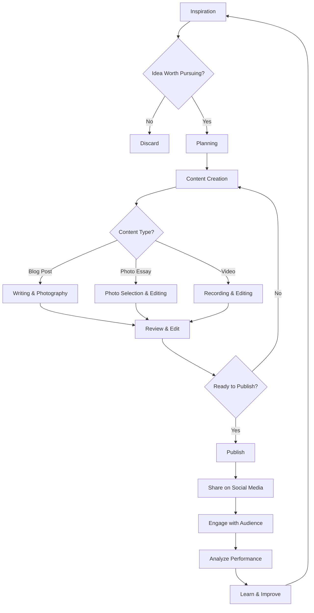
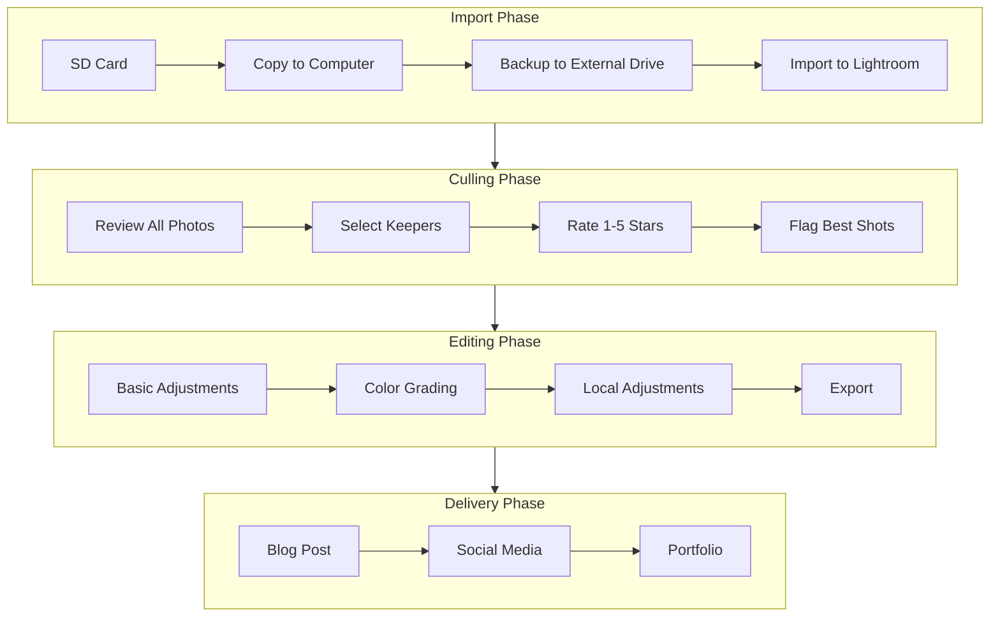
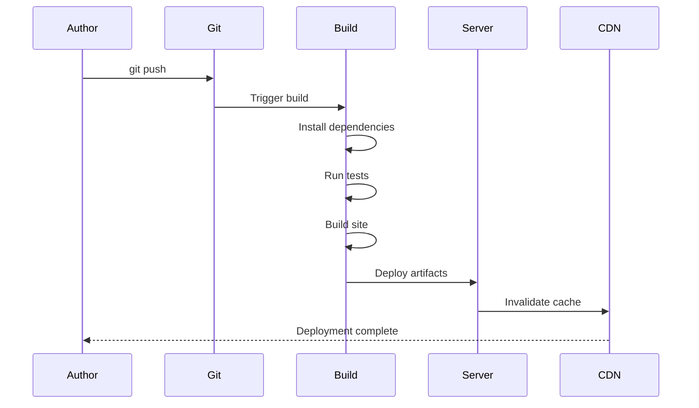

# My Creative Workflow

A behind-the-scenes look at how I create content, from inspiration to publication.

## Table of Contents

- [My Creative Process](#my-creative-process)
- [Tools I Use](#tools-i-use)
- [Code Examples](#code-examples)
- [Workflow Diagrams](#workflow-diagrams)

## My Creative Process

Creating content is both an art and a science. Here's my systematic approach to bringing ideas to life.

### Phase 1: Inspiration

Inspiration strikes in unexpected moments. I capture ideas using:

- Morning pages (stream of consciousness writing)
- Photo walks with my camera
- Conversations with interesting people
- Books, podcasts, and documentaries

### Phase 2: Planning

Once I have an idea, I structure it:

```typescript
interface ContentPlan {
  title: string;
  category: 'travel' | 'lifestyle' | 'creative' | 'growth';
  outline: string[];
  assets: {
    photos: number;
    videos: number;
    graphics: number;
  };
  deadline: Date;
}

function createContentPlan(title: string): ContentPlan {
  return {
    title,
    category: 'lifestyle',
    outline: ['Introduction', 'Main Content', 'Conclusion'],
    assets: {
      photos: 10,
      videos: 2,
      graphics: 3,
    },
    deadline: new Date(Date.now() + 7 * 24 * 60 * 60 * 1000), // 1 week
  };
}
```

## Tools I Use

### Photography Stack

```bash
# My photo editing workflow
#!/bin/bash

echo "Starting photo editing session..."

# Import photos from SD card
rsync -av /Volumes/SD_CARD/ ./photos/raw/

# Create backups
cp -r ./photos/raw/ ./photos/backup/

# Open Lightroom
open -A "Adobe Lightroom Classic"

echo "Ready to edit!"
```

### Blog Deployment

```python
#!/usr/bin/env python3
"""
Automated blog deployment script
"""

import subprocess
import sys
from datetime import datetime

def deploy_blog():
    """Build and deploy the blog"""
    print(f"🚀 Starting deployment at {datetime.now()}")
    
    # Build the project
    result = subprocess.run(['bun', 'run', 'build'], 
                          capture_output=True, 
                          text=True)
    
    if result.returncode != 0:
        print(f"❌ Build failed: {result.stderr}")
        sys.exit(1)
    
    print("✅ Build successful!")
    
    # Deploy to server
    subprocess.run(['rsync', '-avz', 'dist/', 'user@server:/var/www/blog/'])
    
    print(f"🎉 Deployment complete at {datetime.now()}")

if __name__ == '__main__':
    deploy_blog()
```

## Workflow Diagrams

### Content Creation Flow

Here's my complete content creation workflow:



### Photo Editing Workflow

My detailed photo editing process:



### Publishing Pipeline

The technical side of publishing:



## Code Examples

### Responsive Image Component

Here's how I handle responsive images in my blog:

```typescript
import { Component, Input } from '@angular/core';

interface ImageSrc {
  url: string;
  width: number;
}

@Component({
  selector: 'app-responsive-image',
  template: `
    
  `,
  styles: [`
    .responsive-image {
      max-width: 100%;
      height: auto;
      display: block;
    }
  `],
})
export class ResponsiveImageComponent {
  @Input() images: ImageSrc[] = [];
  @Input() alt = '';
  @Input() sizes = '(max-width: 768px) 100vw, 50vw';
  
  get defaultSrc(): string {
    return this.images[0]?.url || '';
  }
  
  get srcset(): string {
    return this.images
      .map(img => `${img.url} ${img.width}w`)
      .join(', ');
  }
}

// Usage:
// <app-responsive-image
//   [images]="[
//     { url: 'photo-400.jpg', width: 400 },
//     { url: 'photo-800.jpg', width: 800 },
//     { url: 'photo-1200.jpg', width: 1200 }
//   ]"
//   alt="Beautiful landscape"
// />
```

### Social Media Scheduler

I automate my social media posting:

```javascript
/**
 * Schedule social media posts across platforms
 */
class SocialMediaScheduler {
  constructor(apiKeys) {
    this.apiKeys = apiKeys;
    this.platforms = ['twitter', 'instagram', 'facebook'];
  }

  async schedulePost(content, platforms, scheduleTime) {
    const posts = [];

    for (const platform of platforms) {
      const post = {
        platform,
        content: this.formatForPlatform(content, platform),
        scheduledFor: scheduleTime,
        status: 'pending',
      };

      posts.push(this.createPost(post));
    }

    return Promise.all(posts);
  }

  formatForPlatform(content, platform) {
    switch (platform) {
      case 'twitter':
        return content.slice(0, 280);
      case 'instagram':
        return content + '\n\n#blog #lifestyle #creativity';
      case 'facebook':
        return content;
      default:
        return content;
    }
  }

  async createPost(post) {
    console.log(`Scheduling ${post.platform} post for ${post.scheduledFor}`);
    // API call would go here
    return { id: Math.random().toString(36), ...post };
  }
}

// Usage
const scheduler = new SocialMediaScheduler(apiKeys);
await scheduler.schedulePost(
  'New blog post is live! Check out my creative workflow...',
  ['twitter', 'instagram', 'facebook'],
  new Date('2026-04-01T09:00:00Z')
);
```

## Project Structure

Here's how I organize my blog project:

```
naravisuals-web/
├── src/
│   ├── app/
│   │   ├── article/
│   │   │   ├── components/
│   │   │   │   ├── article-reader/
│   │   │   │   ├── article-list/
│   │   │   │   ├── code-block/
│   │   │   │   └── mermaid-diagram/
│   │   │   └── services/
│   │   ├── shared/
│   │   │   ├── components/
│   │   │   ├── services/
│   │   │   └── utils/
│   │   └── app.component.ts
│   ├── assets/
│   ├── docs/ (markdown articles)
│   └── main.ts
├── scripts/
│   └── generate-articles.ts
└── package.json
```

## Lessons Learned

Through this workflow, I've discovered:

1. **Consistency beats intensity** - Regular creation is better than bursts
2. **Systems enable creativity** - Good processes free mental space
3. **Automation saves time** - Script repetitive tasks
4. **Feedback improves quality** - Share early, iterate often
5. **Rest is productive** - Breaks lead to better ideas

---

**Your Turn:** What does your creative workflow look like? I'd love to hear about your process!

*Share your thoughts in the comments or tag me on social media!*
