# Mermaid.js Diagram Examples

A comprehensive showcase of all Mermaid diagram types you can use in your markdown articles.

## Table of Contents

- [Flowcharts](#flowcharts)
- [Sequence Diagrams](#sequence-diagrams)
- [Class Diagrams](#class-diagrams)
- [State Diagrams](#state-diagrams)
- [Gantt Charts](#gantt-charts)
- [Pie Charts](#pie-charts)
- [Mind Maps](#mind-maps)
- [Timeline](#timeline)

## Flowcharts

Flowcharts are perfect for showing processes, workflows, and decision trees.

### Basic Flowchart

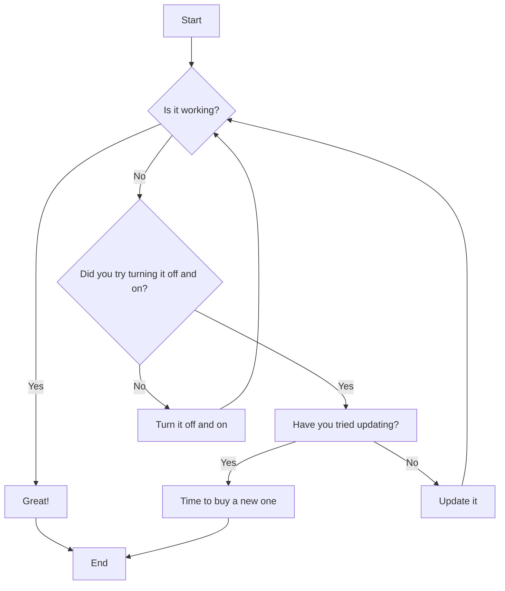

### Complex Process Flow

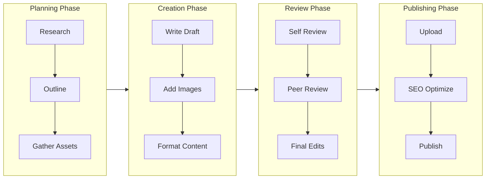

### Decision Tree

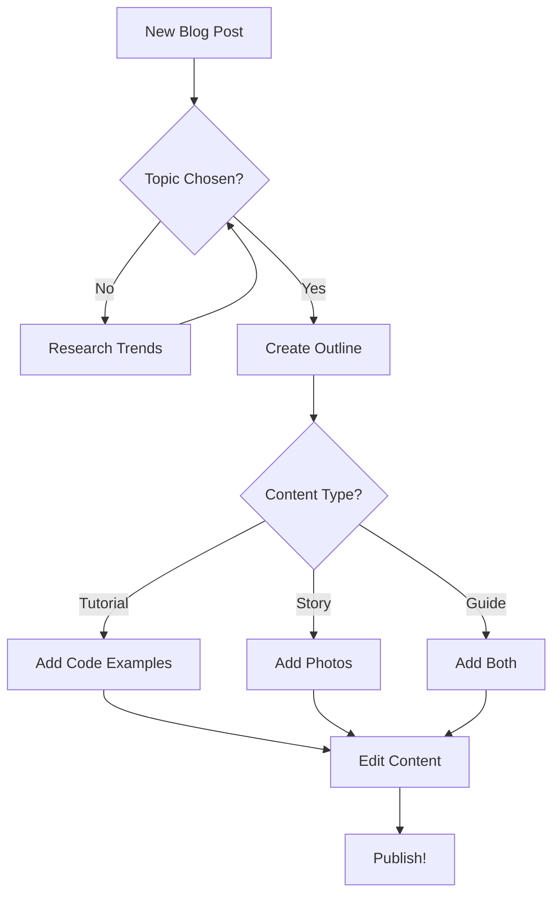

## Sequence Diagrams

Sequence diagrams show interactions between entities over time.

### Blog Publishing Flow

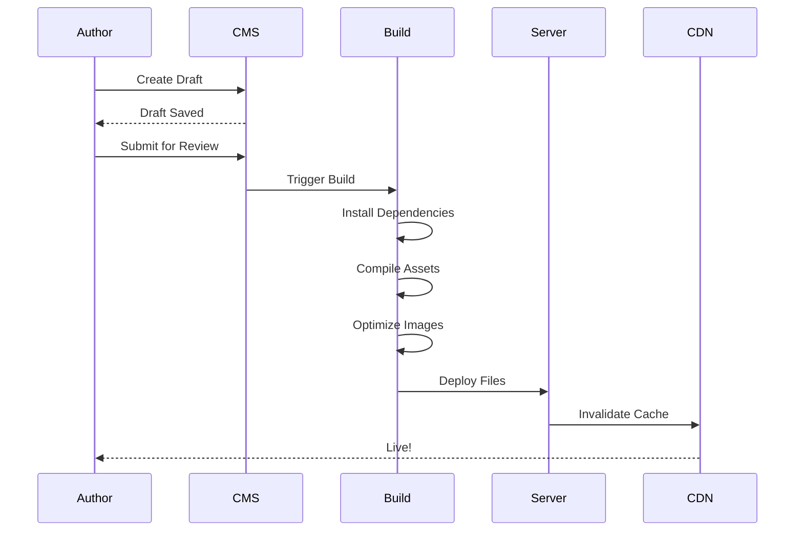

### User Authentication

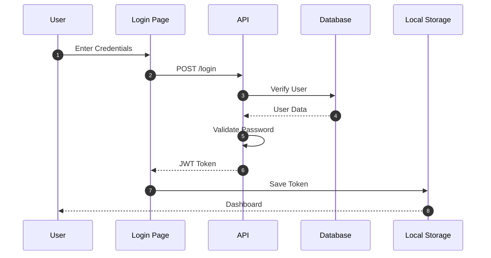

## Class Diagrams

Class diagrams show the structure of systems.

### Blog System Architecture

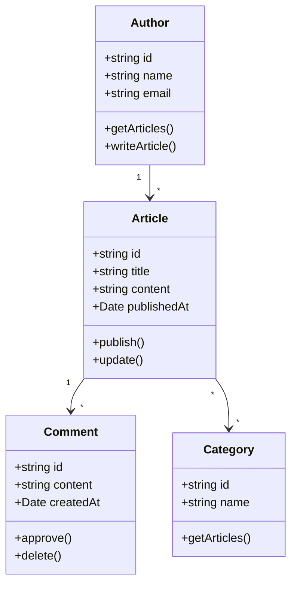

## State Diagrams

State diagrams show the lifecycle of entities.

### Article Lifecycle

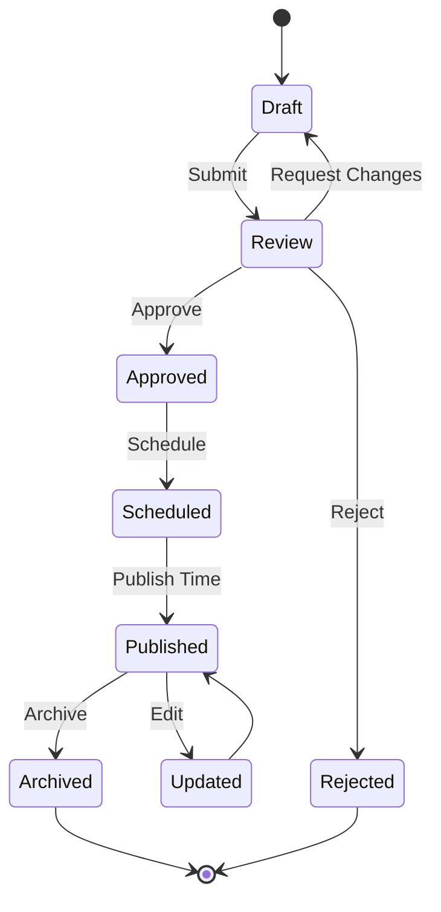

### User Journey

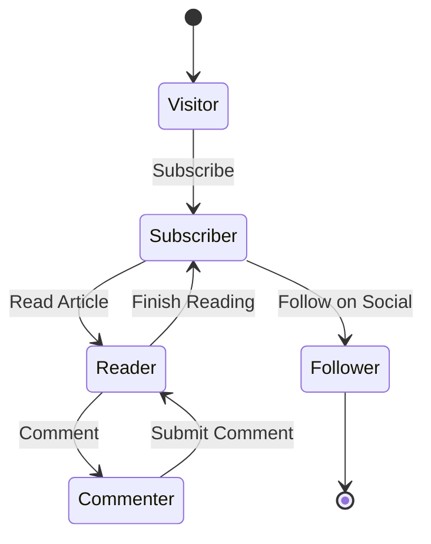

## Gantt Charts

Gantt charts show project timelines.

### Blog Content Calendar

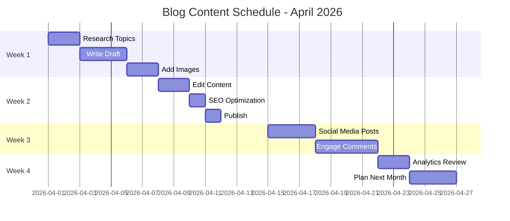

### Project Timeline

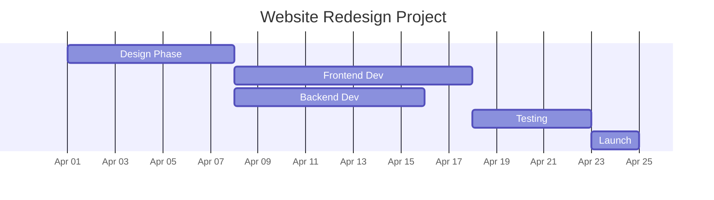

## Pie Charts

Pie charts show proportions.

### Content Distribution

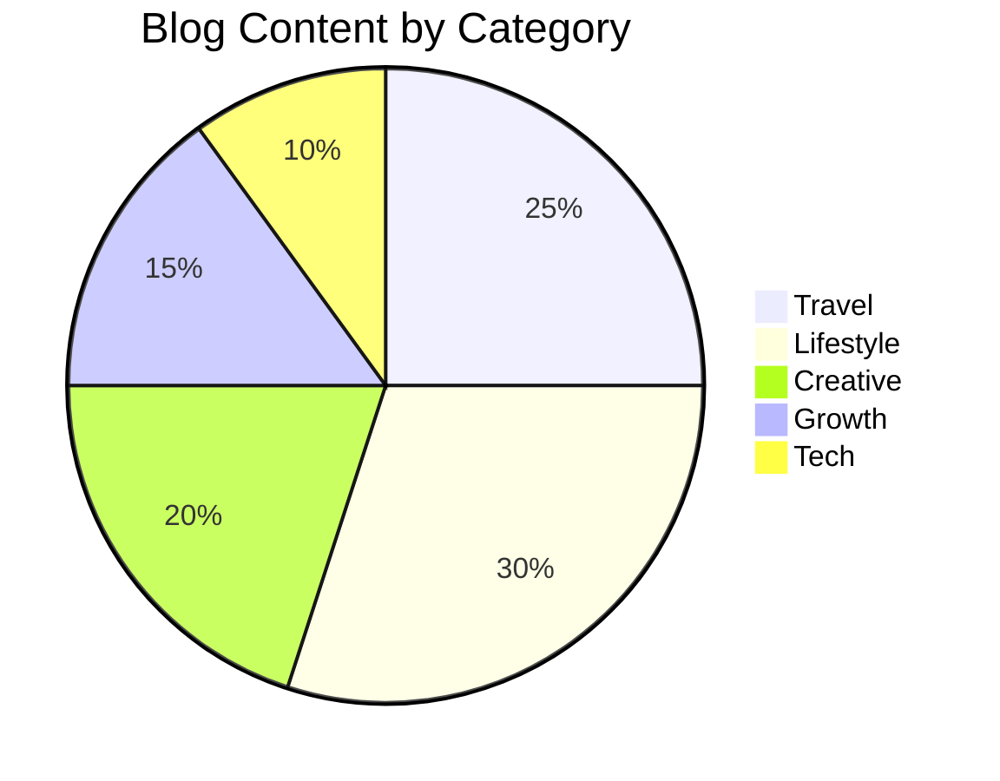

### Time Allocation

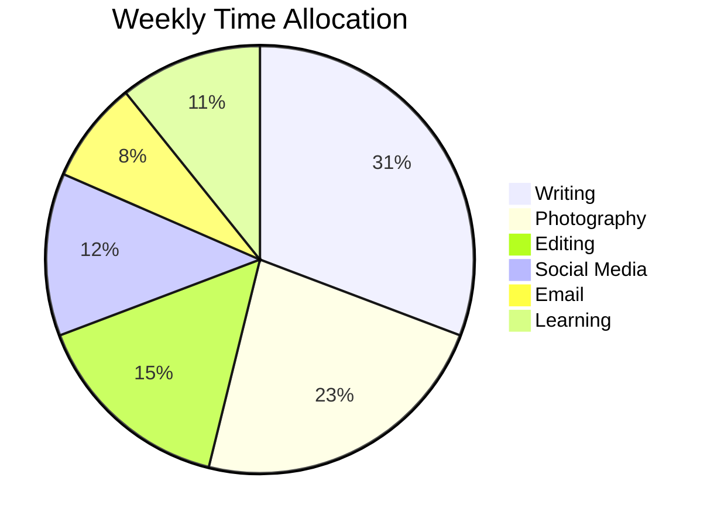

## Mind Maps

Mind maps organize ideas hierarchically.

### Content Strategy

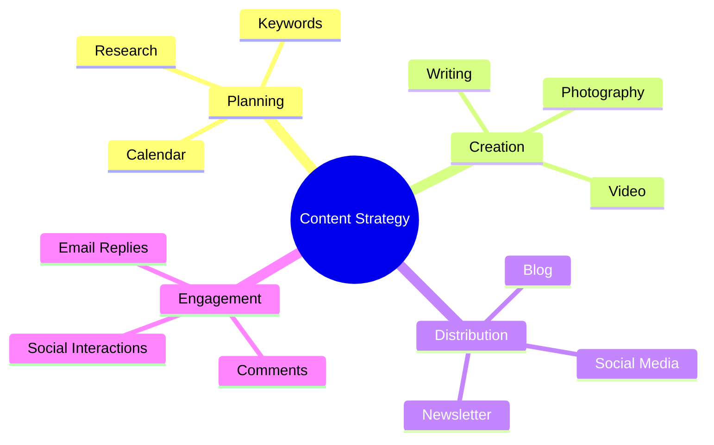

### Blog Topics

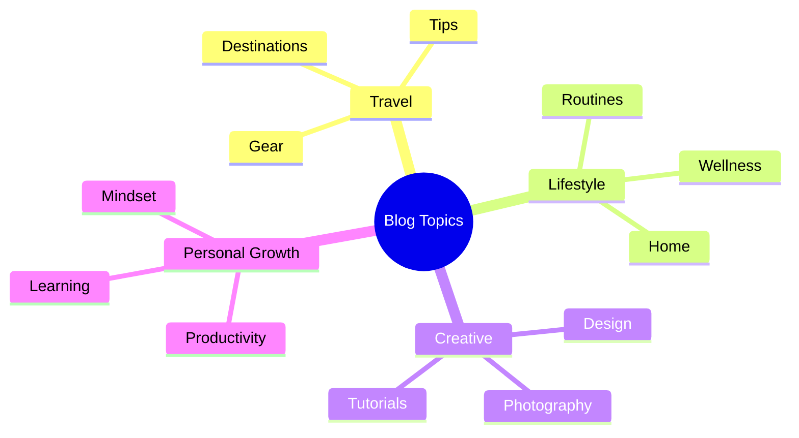

## Timeline

Timelines show events in chronological order.

### My Blog Journey

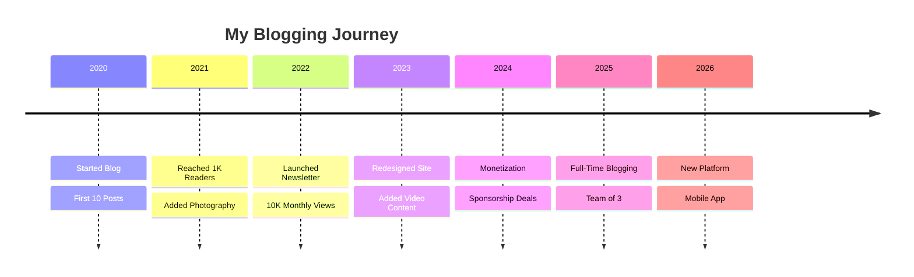

## Combining Diagrams

You can use multiple diagrams in one article:

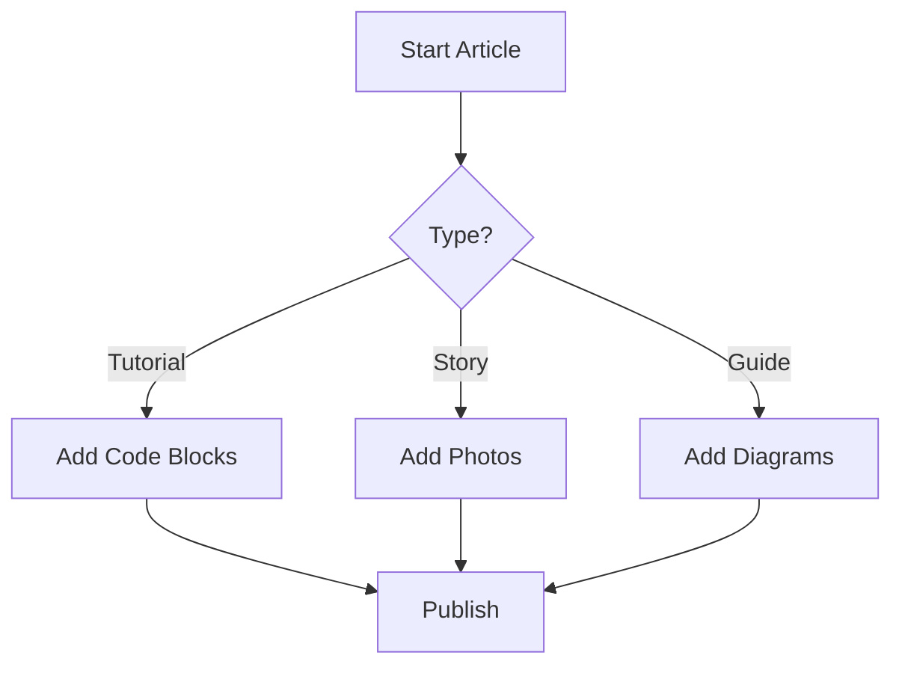

---

## How to Use

1. **Choose the right diagram type** for your data
2. **Use code fences** with `mermaid` language
3. **Keep it simple** - don't overcrowd
4. **Test rendering** on mobile and desktop

## Tips

- **Flowcharts**: Best for processes and decisions
- **Sequence**: Show interactions over time
- **Class**: Display system architecture
- **Gantt**: Project timelines and schedules
- **Pie**: Show proportions and distributions
- **Mind Map**: Organize hierarchical ideas
- **Timeline**: Chronological events

---

**Try it yourself!** Copy any of these examples and modify them for your needs.

*What's your favorite diagram type? Let me know in the comments!*
