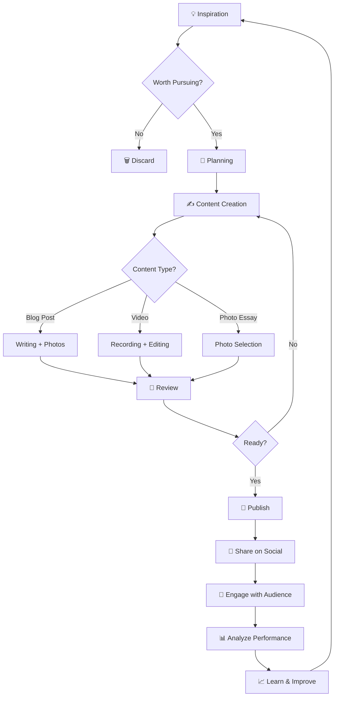
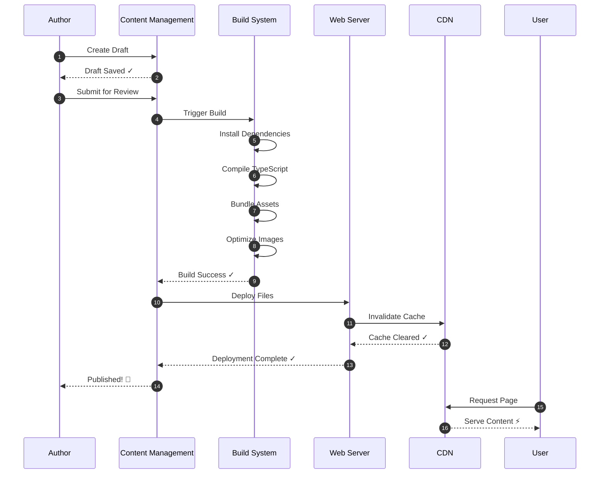
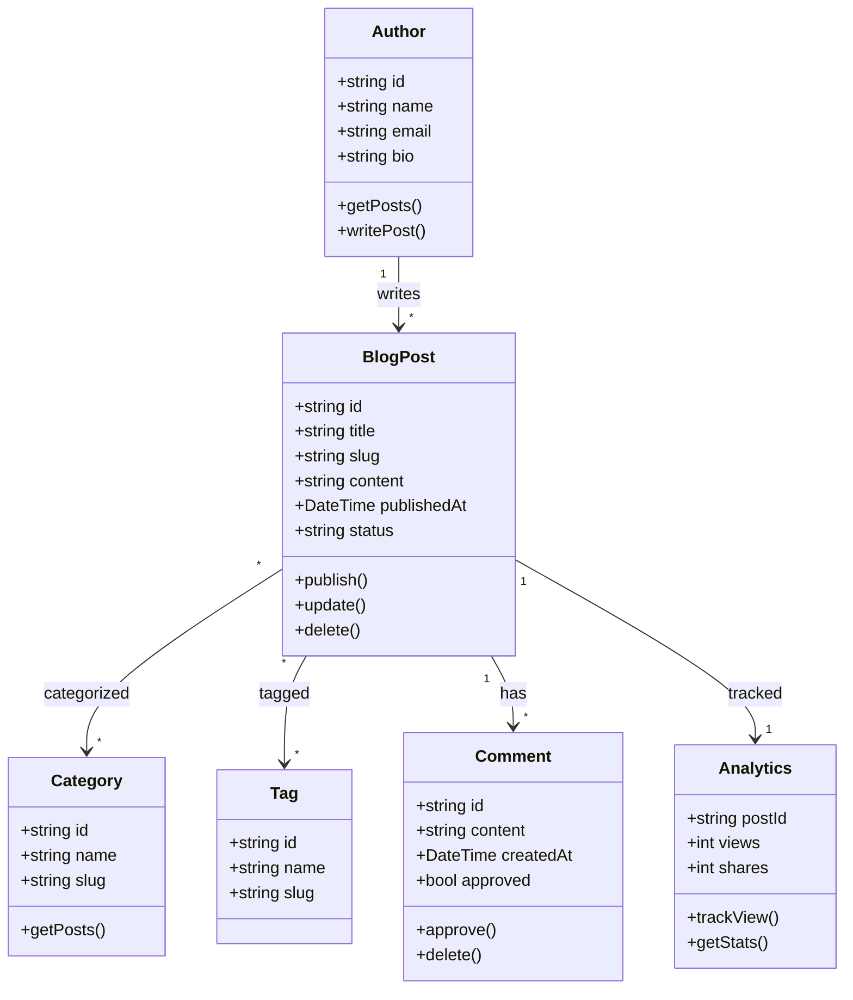
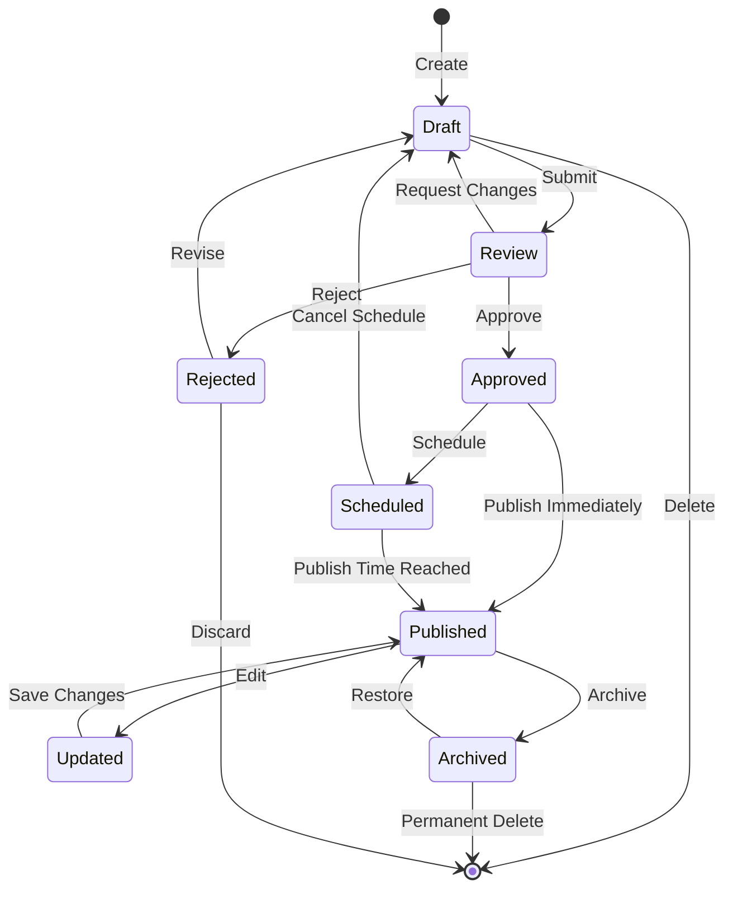
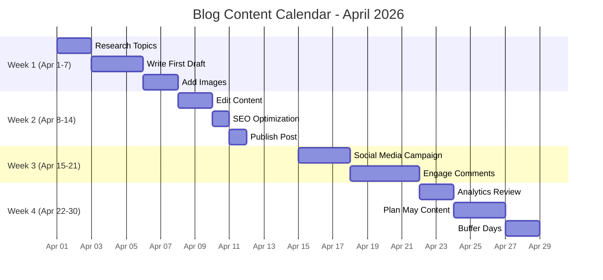
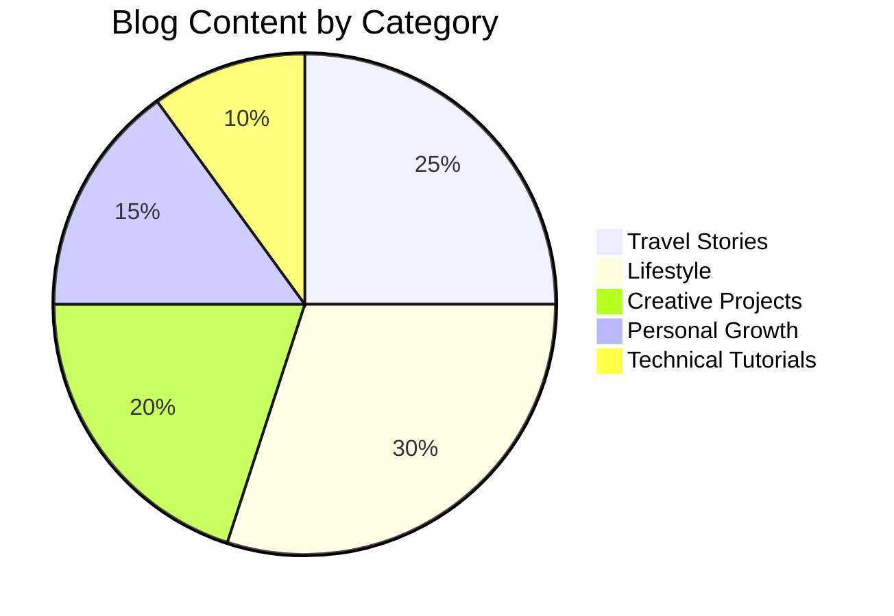
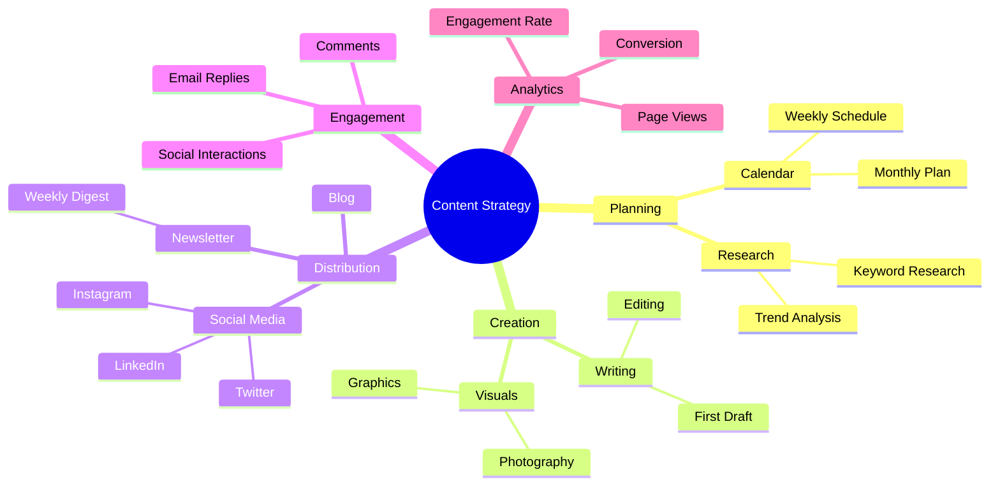
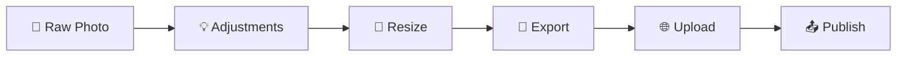

# Technical Demo: Code & Diagrams

This article demonstrates the full capabilities of code syntax highlighting and Mermaid.js diagram rendering.

## Table of Contents

- [Code Syntax Highlighting](#code-syntax-highlighting)
- [Mermaid.js Diagrams](#mermaidjs-diagrams)
- [Tables with Borders](#tables-with-borders)
- [Mixed Content](#mixed-content)

## Code Syntax Highlighting

### TypeScript Example

Here's a complete Angular component with decorators and type safety:

```typescript
import { Component, Input, Output, EventEmitter } from '@angular/core';

interface BlogPost {
  id: string;
  title: string;
  content: string;
  publishedAt: Date;
  tags: string[];
}

@Component({
  selector: 'app-blog-post',
  template: `
    <article class="post">
      <h1>{{ post.title }}</h1>
      <time>{{ post.publishedAt | date }}</time>
      <div [innerHTML]="post.content"></div>
    </article>
  `,
  styles: [`
    .post {
      max-width: 800px;
      margin: 0 auto;
      padding: 2rem;
    }
  `],
})
export class BlogPostComponent {
  @Input() post!: BlogPost;
  @Output() share = new EventEmitter<void>();
  
  constructor(private readonly analytics: AnalyticsService) {}
  
  async ngOnInit(): Promise<void> {
    await this.analytics.track('post_view', {
      postId: this.post.id,
    });
  }
  
  onShare(): void {
    this.share.emit();
  }
}
```

### Python Data Processing

A complete example with dataclasses and type hints:

```python
from dataclasses import dataclass, field
from datetime import datetime
from typing import List, Optional, Dict
from pathlib import Path

@dataclass
class BlogAnalytics:
    """Track blog post analytics"""
    post_id: str
    views: int = 0
    shares: int = 0
    comments: int = 0
    metadata: Dict[str, any] = field(default_factory=dict)
    
    def add_view(self) -> None:
        """Increment view count"""
        self.views += 1
        self.metadata['last_view'] = datetime.now()
    
    def get_engagement_rate(self) -> float:
        """Calculate engagement rate"""
        if self.views == 0:
            return 0.0
        return (self.shares + self.comments) / self.views * 100
    
    def to_dict(self) -> Dict:
        """Convert to dictionary"""
        return {
            'post_id': self.post_id,
            'views': self.views,
            'engagement_rate': f"{self.get_engagement_rate():.2f}%",
        }

# Usage example
if __name__ == '__main__':
    analytics = BlogAnalytics(post_id='post-123')
    analytics.add_view()
    print(analytics.to_dict())
```

### Bash Automation Script

Complete deployment script with error handling:

```bash
#!/bin/bash

# Blog Deployment Script
# Usage: ./deploy.sh [environment]

set -e  # Exit on error

# Configuration
ENVIRONMENT=${1:-production}
BUILD_DIR="dist"
REMOTE_USER="deploy"
REMOTE_HOST="blog.example.com"
REMOTE_PATH="/var/www/blog"

# Colors
RED='\\e[0;31m'
GREEN='\\e[0;32m'
YELLOW='\\e[1;33m'
BLUE='\\e[0;34m'
NC='\\e[0m'

log_info() {
    echo -e "${BLUE}ℹ️  $1${NC}"
}

log_success() {
    echo -e "${GREEN}✅ $1${NC}"
}

log_error() {
    echo -e "${RED}❌ $1${NC}"
}

log_warning() {
    echo -e "${YELLOW}⚠️  $1${NC}"
}

# Main deployment function
deploy() {
    log_info "Starting deployment to ${ENVIRONMENT}"
    
    # Step 1: Build
    log_info "Building project..."
    if bun run build; then
        log_success "Build completed"
    else
        log_error "Build failed!"
        exit 1
    fi
    
    # Step 2: Test
    log_info "Running tests..."
    if bun test; then
        log_success "All tests passed"
    else
        log_warning "Some tests failed"
        read -p "Continue anyway? (y/n) " -n 1 -r
        if [[ ! $REPLY =~ ^[Yy]$ ]]; then
            exit 1
        fi
    fi
    
    # Step 3: Deploy
    log_info "Deploying to server..."
    rsync -avz \
        --delete \
        --exclude '.git' \
        ${BUILD_DIR}/ \
        ${REMOTE_USER}@${REMOTE_HOST}:${REMOTE_PATH}/
    
    log_success "Deployment complete!"
    log_info "View your site at: https://${REMOTE_HOST}"
}

# Run deployment
deploy
```

### JavaScript Class with Async Operations

Modern ES6+ with async/await and error handling:

```javascript
/**
 * Blog API Client
 * Handles all API communication for the blog
 */
class BlogApiClient {
  constructor(baseUrl, apiKey) {
    this.baseUrl = baseUrl;
    this.apiKey = apiKey;
    this.cache = new Map();
  }

  async request(endpoint, options = {}) {
    const url = `${this.baseUrl}${endpoint}`;
    const cacheKey = `${endpoint}:${JSON.stringify(options)}`;

    // Check cache first
    if (this.cache.has(cacheKey)) {
      console.log('📦 Returning cached response');
      return this.cache.get(cacheKey);
    }

    try {
      const response = await fetch(url, {
        ...options,
        headers: {
          'Content-Type': 'application/json',
          'Authorization': `Bearer ${this.apiKey}`,
          ...options.headers,
        },
      });

      if (!response.ok) {
        throw new Error(`HTTP ${response.status}: ${response.statusText}`);
      }

      const data = await response.json();
      
      // Cache the response
      this.cache.set(cacheKey, data);
      
      return data;
    } catch (error) {
      console.error('API request failed:', error);
      throw error;
    }
  }

  async getPosts(page = 1, limit = 10) {
    return this.request(`/posts?page=${page}&limit=${limit}`);
  }

  async getPost(slug) {
    return this.request(`/posts/${slug}`);
  }

  async createPost(postData) {
    return this.request('/posts', {
      method: 'POST',
      body: JSON.stringify(postData),
    });
  }

  clearCache() {
    this.cache.clear();
    console.log('Cache cleared');
  }
}

// Usage
const api = new BlogApiClient('https://api.example.com', 'your-api-key');
const posts = await api.getPosts(1, 20);
console.log(`Loaded ${posts.length} posts`);
```

## Mermaid.js Diagrams

### Flowchart: Content Creation Process

This shows my complete content creation workflow:



### Sequence Diagram: Blog Publishing Flow

Shows the technical flow from draft to published:



### Class Diagram: Blog System Architecture

Shows the database schema and relationships:



### State Diagram: Article Lifecycle

Shows all possible states of a blog post:



### Gantt Chart: Content Calendar

Project timeline for monthly content:



### Pie Chart: Content Distribution

Shows the breakdown of content types:



### Mind Map: Content Strategy

Hierarchical organization of content strategy:



## Tables with Borders

### Content Categories Table

Full table with all borders visible:

| Category | Posts | Avg Read Time | Engagement Rate | Last Updated |
|----------|-------|---------------|-----------------|--------------|
| Travel | 25 | 8 min | 4.2% | 2026-03-28 |
| Lifestyle | 30 | 6 min | 5.1% | 2026-03-29 |
| Creative | 20 | 10 min | 3.8% | 2026-03-27 |
| Growth | 15 | 7 min | 4.5% | 2026-03-30 |
| Technical | 10 | 12 min | 6.2% | 2026-03-26 |

### Technology Stack Table

Another example with different content:

| Technology | Purpose | Version | Status |
|------------|---------|---------|--------|
| Angular | Frontend Framework | 19.x | ✅ Active |
| Rspack | Build Tool | 1.x | ✅ Active |
| Bun | Runtime & Package Manager | 1.x | ✅ Active |
| TypeScript | Language | 5.x | ✅ Active |
| Marked | Markdown Parser | 17.x | ✅ Active |
| Mermaid | Diagram Library | 11.x | ✅ Active |

### Social Media Platforms Table

Table showing platform statistics:

| Platform | Followers | Posts | Engagement | Priority |
|----------|-----------|-------|------------|----------|
| Instagram | 15.2K | 342 | 4.8% | 🔴 High |
| Twitter | 8.5K | 1,247 | 3.2% | 🟡 Medium |
| LinkedIn | 5.1K | 89 | 5.6% | 🟢 Low |
| YouTube | 2.3K | 45 | 7.1% | 🟡 Medium |

## Mixed Content

### Code + Diagram Combination

Here's how I process photos, shown in both code and diagram:

```python
from PIL import Image
from pathlib import Path

def process_photo(input_path: str, output_path: str) -> dict:
    """Process a photo with standard adjustments"""
    img = Image.open(input_path)
    
    # Basic adjustments
    img = img.adjust_brightness(1.2)
    img = img.adjust_contrast(1.1)
    img = img.adjust_saturation(1.3)
    
    # Resize for web
    img.thumbnail((1920, 1080))
    
    # Save with optimization
    img.save(output_path, optimize=True, quality=85)
    
    return {
        'original_size': img.size,
        'output_path': output_path,
        'format': img.format,
    }
```

The workflow visualized:



---

## Summary

This article demonstrates:

✅ **Syntax Highlighting** - TypeScript, Python, Bash, JavaScript  
✅ **Mermaid Diagrams** - 8 different diagram types  
✅ **Tables with Borders** - Full border styling on all cells  
✅ **Mixed Content** - Code and diagrams together  
✅ **Responsive Design** - Works on mobile and desktop  

---

**Questions?** Drop them in the comments below! 👇
